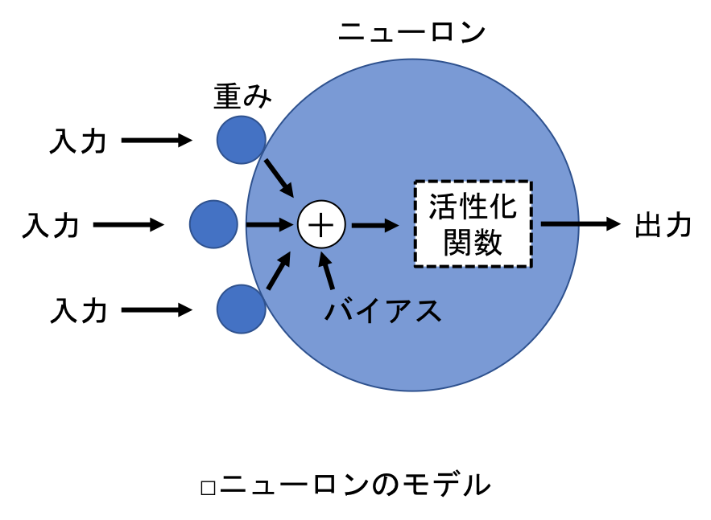

## 4.2 神経細胞のモデル化
- 多数のニューロンがつながり合うことで高度な認識・判断能力が発揮される．
- ニューロンには複数の入力があるが，出力は１つだけ．
- 各入力には，重みを掛け合わせる．
- 入力と重みを掛け合わせた値の総和に，バイアスと呼ばれる定数を足す．
- バイアスは，ニューロンの感度を表し，バイアスの大小により，ニューロンの興奮のしやすさが調整される．

  

- 入力と重みの積の総和にバイアスを足した値は，活性化関数と呼ばれる関数で処理され，ニューロンの興奮状態を表す信号に変換される．
- この信号がニューロンの出力となる．
- 活性化関数は，言わばニューロンを興奮させるための関数である．
  
- ニューロンのモデルを数式化する．
- 入力総数を $n$，重みを $w$，ニューロンへの入力を $x$ とすると，入力と重みの積和は以下のように表せる：
$$
\sum_{k=1}^{n} x_k w_k．
$$
- 次に，入力と重みの総和にバイアス $b$ を加える．これを $u$ で表すと，次の式を得る：
$$
u = \sum_{k=1}^{n} (x_k w_k) + b．
$$
- この $u$ を活性化関数に入力する．活性化関数を $f$，ニューロンからの出力を $y$ で表すと，活性化関数と出力の関係は次の式で表される：
$$
y = f(u) = f( \sum_{k=1}^{n} (x_k w_k) + b )．
$$
- 以上により，ニューロンのモデルを数式に落とし込むことができた．
- シンプルで，コンピュータ上で扱いやすい数式であるため，ディープラーニングでは一般的にこの数式が用いられている．
- このニューロンが次のニューロンにつながっている場合，$y$ は次のニューロンの入力となる．