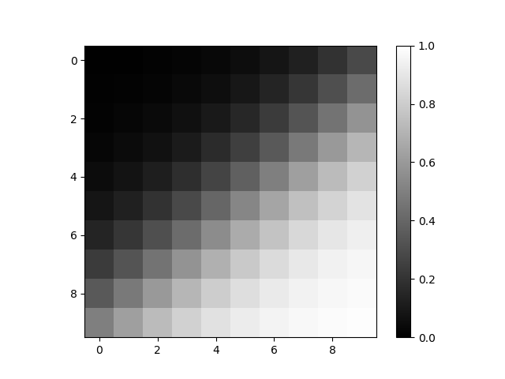
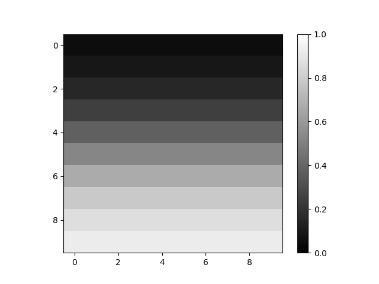
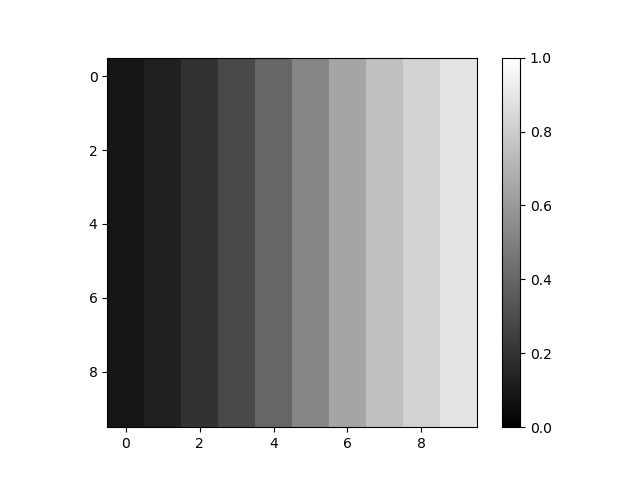
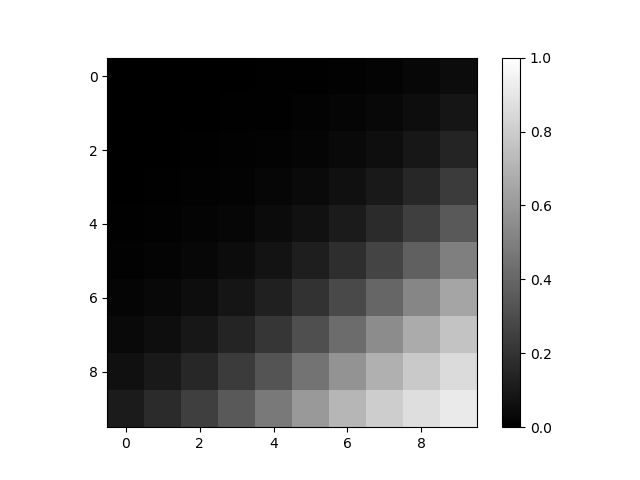
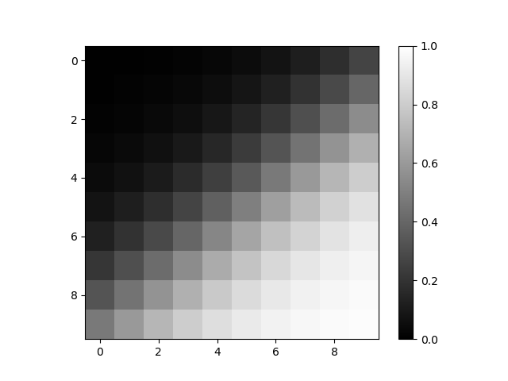
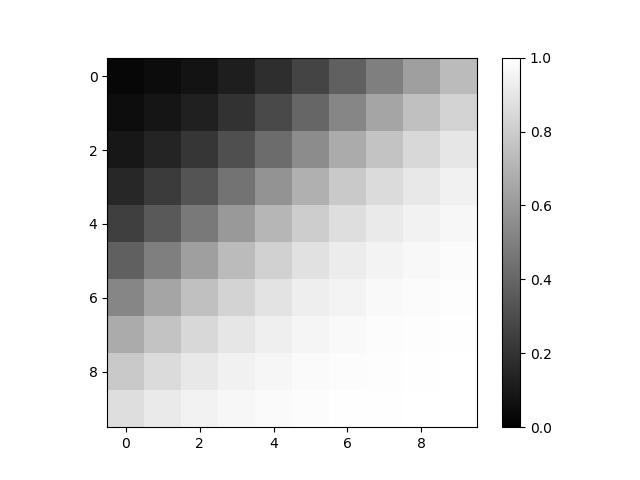
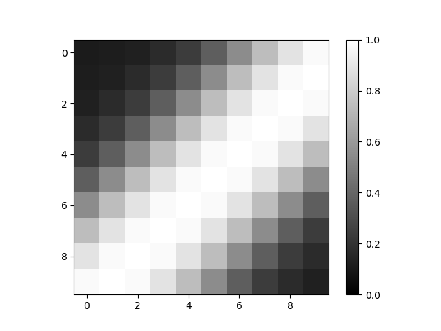
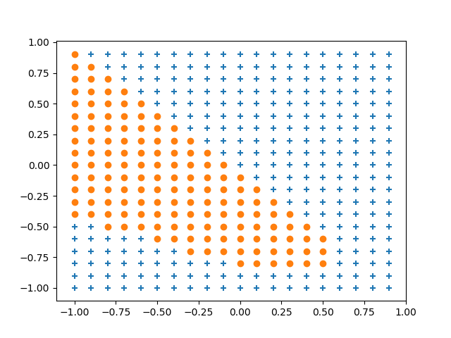

[](2019/05/11)

## 4.6 ニューラルネットワークに実装
- 実際にディープラーニングで学習をおこなう際は，最初に重みとバイアスをランダムに設定し，学習中に変化させる．
- しかし，この節では，重みとバイアスがニューラルネットワークにどのような影響を与えるのかを確かめるために，重みとバイアスの値は固定とする．

### 4.6.1 単一のニューロンを実装
- x座標，y座標の２つを入力として，単一のニューロンからの出力を計算する．
- 出力をグリッドごとのマスの色で可視化する．マスの色は出力の大きさを表す．
- 単一のニューロンによる処理のコード：

``` Python
import numpy as np
import matplotlib.pyplot as plt

# x,y coords
X = np.arange(-1.0, 1.0, 0.2)
Y = np.arange(-1.0, 1.0, 0.2)

# Grid
grid = np.zeros( (10,10) )

# weight
w_x = 2.5
w_y = 3.0

# bias
b = 0.1

# Calc the neurons in each grid square
for j in range(10):
    for i in range(10):

        # Sum of input and weight products + bias
        u = X[i]*w_x + Y[j]*w_y + b

        # Store output in grid
        y = 1/(1+np.exp(-u))
        grid[j][i] = y
    # end for
# end for

# Show grid
plt.imshow(grid, "gray", vmin=0.0, vmax=1.0)
plt.colorbar()
plt.show()
```

- ループ内の以下の箇所では，入力と重みの積の総和にバイアスを足したものを計算している．
``` python
u = x[i]*w_x + y[j]*w_y + b
```
- これは，以下の式に対応する：
$$
u = \sum_{k=1}^{n}(x_kw_k)+b．
$$
- また，次の箇所は，活性化関数（シグモイド関数）により出力値を計算している：
``` python
y = 1/(1+np.exp(-u))
```
- これは，以下の式に対応する：
$$
y = f(u) = f(\sum_{k=1}^{n}(x_kw_k)+b)．
$$
- 上記のコードを実行すると，次の結果が得られる：

<center>

</center>

- 黒は出力0，すなわちニューロンが興奮していない状態．
- 白は出力1，すなわちニューロンが興奮している状態．
- 左上の黒い領域から，右下の白い領域まで，出力は連続的に変化している．これは，ニューロンの活性化関数にシグモイド関数を使用しているため，0と1の間が表現されているから．

<br>

### 4.6.2 重みとバイアスの影響
#### 重みの影響
- 以下の図のように，重みの値は対応する入力が与える影響の大きさを表す：

|$w_x=-2.5, w_y=3.0$|$w_x=0, w_y=3.0$|$w_x=-2.5, w_y=0$|
|-|-|-|
||||

#### バイアスの影響
- 以下の図のように，バイアスの値はニューロンの興奮しやすさを表す：

|$b=-2.0$|$b=0.0$|$b=2.0$|
|-|-|-|
||||

<br>

### 4.6.3 ニューラルネットワークの実装
- ここからは，ニューラルネットワーク，すなわち複数のニューロンからなるネットワークを実装する．
- まず，出力が連続になる問題，すなわち回帰問題かを扱う
- 今回は，3層のシンプルなニューラルネットワークを実装する：

<center>

</center>

- このニューラルネットワークは，入力層（ニューロン数：$n=2$），中間層（$n=2$），出力層（$n=3$）の3層構造．
- 中間層の活性化関数はシグモイド関数で，出力層の活性化関数は回帰であるため，恒等関数になる．
- ディープラーニングでは近年，中間層の活性化関数にReLUを使うことが多いが，今回は結果を連続的に表示するためにシグモイド関数を使う．

<br>

### 4.6.4 各層の実装
#### 中間層
- 中間層は，次のように関数で実装する：
``` python
def middle_layer(x, w, b):
    u = np.dot(x, w) + b
    return 1/(1+np.exp(-u))
```
- この関数は，引数として中間層への入力(x)，重み(w)とバイアス(b)を受け取る．
- 得られたuを活性化関数であるシグモイド関数に入れて，中間層の出力を得ることができる．

#### 出力層
- 出力層も，次のように中間層と同様に関数で実装する：
``` python
def output_layer(x, w, b):
    u = np.dot(x, w) + b
    return u
```
- 中間層との違いは，活性化関数が恒等関数であること．

#### 重み
- 重みは， 次のようにNumPyの配列を用いた行列として実装する：
``` python
w_inp_mid = np.array([[4.0, 4.0], 
                      [4.0, 4.0]])   # 中間層2×2の行列
w_mid_out = np.array([[1.0], 
                      [-1.0]])       # 出力層2×1の行列
```
- <u>入力層のニューロン数は2，中間層のニューロン数は2なので，中間層には2×2=4個の重みが必要になる．</u>
- <u>また，中間層のニューロン数は2，出力層のニューロン数は1なので，出力層には2×1=2個の重みが必要になる．</u>

#### バイアス
- バイアスは， 次のようにベクトルとして実装する：
``` python
b_inp_mid = np.array([3.0, -3.0])   # 中間層
b_mid_out = np.array([0.1])         # 出力層
```
- <u>バイアスの数はニューロンの数に等しいので，中間層には2個，出力層には1個のバイアスが必要となる．</u>
- なお，重みとバイアスの値は適当な値を設定している．

### 順伝播
- 以上を踏まえて，順伝播を次のように実装する：
``` python
inp = np.array([ ... ]) # 入力層
mid = middle_layer(inp, w_inp_mid, b_inp_mid) # 中間層
out = output_layer(mid, w_mid_out, b_mid_out) # 出力層
```
- <u>入力を重みとバイアスとともに中間層の関数に渡す．</u>
- <u>その後，中間層の出力を重みとバイアスとともに，出力層の関数に渡して，出力を得る．</u>

<br>

### 4.6.5 ニューラルネットワーク（回帰）
- ニューラルネットワークのコード全体は，次の通り：
``` python
import numpy as np
import matplotlib.pyplot as plt

# x,y coords
X = np.arange(-1.0, 1.0, 0.2)
Y = np.arange(-1.0, 1.0, 0.2)

# Grid
grid = np.zeros( (10,10) )

# Weight
w_inp_mid = np.array([[4.0, 4.0], 
                      [4.0, 4.0]])   # Middle-layer：2×2
w_mid_out = np.array([[1.0], 
                      [-1.0]])       # Output-layer：2×1

# Bias
b_inp_mid = np.array([3.0, -3.0])   # Middle
b_mid_out = np.array([0.1])         # Output

# Middle layer
def middle_layer(x, w, b):
    u = np.dot(x, w) + b
    return 1/(1+np.exp(-u))

# Output layer
def output_layer(x, w, b):
    u = np.dot(x, w) + b
    return u


# Calc the neurons in each grid square
for j in range(10):
    for i in range(10):

        # Forward propagation
        inp = np.array( [X[i], Y[j]] )
        mid = middle_layer(inp, w_inp_mid, b_inp_mid)
        out = output_layer(mid, w_mid_out, b_mid_out)

        # Store output of NN in grid
        grid[j][i] = out[0]

    # end for
# end for

# Show grid
plt.imshow(grid, "gray", vmin=0.0, vmax=1.0)
plt.colorbar()
plt.show()
```
- グリッドに出力を格納する際に，outに[0]が付いているのはoutが要素数1の配列だから．
- 上記のニューラルネットワークのコードを実行すると，次の結果が得られる：

<center>

</center>

- 単一ニューロンの際は，白の領域と黒の領域の２つに分けるのみであったのに対して，このニューラルネットワークを用いると白が黒に挟まれる結果となった．
- より複雑な条件で，ニューロンが興奮するようになっている．

<br>

### 4.6.7 ニューラルネットワーク（分類）
- 次に，ニューラルネットワークで分類問題を扱う，
- 次の図で示すネットワークを実装する：

<center>

</center>

- 回帰の際と，層の数および入力層，中間層は変わらないが，出力層にはニューロンが2つある点が異なる．
- 出力層の活性化関数には，ソフトマックス関数を用いる．
- ニューラルネットワークのコード全体は，次の通り：
``` python
import numpy as np
import matplotlib.pyplot as plt

# x,y coords
X = np.arange(-1.0, 1.0, 0.1)
Y = np.arange(-1.0, 1.0, 0.1)

# Weight
w_inp_mid = np.array([[1.0, 2.0], 
                      [2.0, 3.0]])  # Middle-layer：2×2
w_mid_out = np.array([[-1.0, 1.0], 
                      [1.0, -1.0]]) # Output-layer：2×2

# Bias
b_inp_mid = np.array([0.3, -0.3])   # Middle
b_mid_out = np.array([0.4, 0.1])    # Output

# Middle layer
def middle_layer(x, w, b):
    u = np.dot(x, w) + b
    return 1/(1+np.exp(-u)) # sigmoid function

# Output layer
def output_layer(x, w, b):
    u = np.dot(x, w) + b
    return np.exp(u)/np.sum(np.exp(u)) # softmax function

# List for storing analysis results
x_1 = []
y_1 = []
x_2 = []
y_2 = []


# Calc the neurons in each grid square
for j in range(20):
    for i in range(20):

        # Forward propagation
        inp = np.array( [X[i], Y[j]] )
        mid = middle_layer(inp, w_inp_mid, b_inp_mid)
        out = output_layer(mid, w_mid_out, b_mid_out)

        # Compare the value of a probability and then classify
        if out[0] > out[1]:
            x_1.append( X[i] )
            y_1.append( Y[j] )
        else:
            x_2.append( X[i] )
            y_2.append( Y[j] )

    # end for
# end for

# Show scatter plot
plt.scatter(x_1, y_1, marker="+")
plt.scatter(x_2, y_2, marker="o")
plt.show()
```

- 上記のニューラルネットワークのコードを実行すると，次の結果が得られる：

<center>

</center>

- 今回は入力を2つに分類したが，出力層のニューロン数を増やせば3つ以上に分類することも可能．
- また，ニューロンの数を増やすことで，さらに複雑な境界で入力を分類できるようになる．