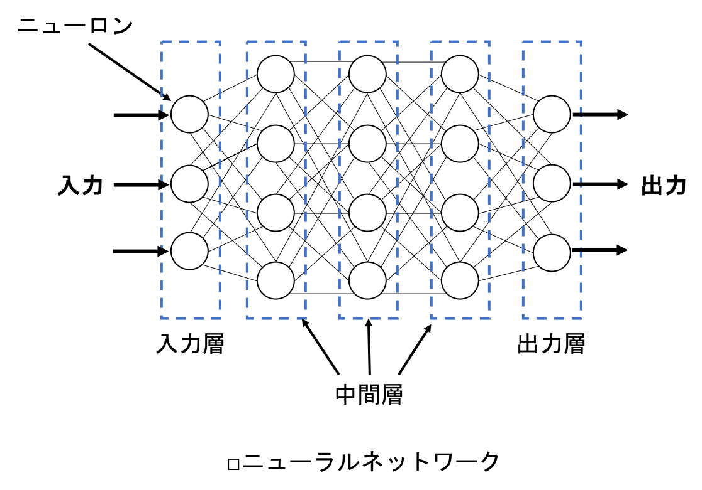

[](2019/05/10)

## 4.3 ニューロンのネットワーク化
- ニューロンを複数接続しネットワーク化することで，ニューラルネットワークが構築される．
- ニューラルネットワークでは，ニューロンを次のように層状に並べる：
<center>

</center>

<br>

- ニューラルネットワークにおける層は，入力層，中間層（隠れ層），出力層の３つに分類することができる．
- 入力層はニューラルネットワーク全体の入力を受け取り，出力層はネットワーク全体の出力を出力する．
- ニューロンの演算がおこなわれるのは，中間層と出力層のみで，入力層は受け取った入力を中間層に渡すのみ．

<br>

- ニューラルネットワークにおいて，入力から出力に向けて情報が伝わっていくことを順伝播という．
- 逆に，出力から入力に向けて情報が遡っていくことを逆伝播という．

<br>

- ここからは，２つの層の順伝播を数式化する．
- 前の層のニューロンの数を $m$，次の層のニューロンの数を $n$ とすると，2つの層の間には $m \times n$ 個の重みがあることになる．2層間の接続を次に図示する：

<center>

</center>

<br>

- 重みの数は入力の数と等しいので，上の層のニューロン数を $m$ とすると，下の層のニューロンは1つあたり $m$ 個の重みを持つことになる．
- 例えば，上の層の1番目のニューロンから，下の層の2番目のニューロンへの入力の重みは $w_{12}$ と表す．

<br>

- 以下のような $m \times n$ の行列に，下の層のすべての重みを格納することができる． $\bold W$ は重みを表す行列：

$$
\bold W = 
\begin{bmatrix}
w_{11} & w_{12} & \cdots & w_{1n} \\
w_{21} & w_{22} & \cdots & w_{2n} \\
\vdots & \vdots & \ddots & \vdots \\
w_{m1} & w_{m2} & \cdots & w_{mn}
\end{bmatrix}．
$$

- また，上の層の出力（=下の層の入力）はベクトルで表すことができる．
- $i$ を上の層の添字，$j$ を下の層の添字とし，$\bold y_i$ を上の層の出力を表すベクトル，$\bold x_j$ を下の層への入力を表すベクトルとすると，次のような表記が可能：

$$
\bold y_i = \bold x_j = 
\begin{bmatrix}
x_1, x_2, \cdots, x_m
\end{bmatrix}．
$$

- 上の層の出力は，下の層の入力と等しくなる．
- バイアスもベクトルで表記することが可能．
- バイアスの数は，下の層のニューロンの数に等しく，下の層のニューロンの数は $n$ なので，バイアス $\bold b_j$ は次のように表すことができる：

$$
\bold b_j = 
\begin{bmatrix}
b_1, b_2, \cdots, b_n
\end{bmatrix}．
$$

<br>

- 以上より，各ニューロンにおける入力と重みの積の総和は，次のように求めることができる：

$$
\bold x_j \bold W = 
\begin{bmatrix}
x_1, x_2, \cdots, x_m
\end{bmatrix}
\begin{bmatrix}
w_{11} & w_{12} & \cdots & w_{1n} \\
w_{21} & w_{22} & \cdots & w_{2n} \\
\vdots & \vdots & \ddots & \vdots \\
w_{m1} & w_{m2} & \cdots & w_{mn}
\end{bmatrix}．
$$

- 行列積の結果は要素数 $n$ のベクトルとなる．
- このベクトルの各要素は，下の層の各ニューロンにおける重みと入力の積の総和になっている．
- これにバイアス $\bold b_j$ を加えたものを $\bold u_j$ とすると，$\bold u_j$ は次のように求めることができる：

$$
\begin{aligned}
\bold u_j 
&= \bold x_j \bold W + \bold b_j \\
&= \begin{bmatrix}
x_1, x_2, \cdots, x_m
\end{bmatrix}
\begin{bmatrix}
w_{11} & w_{12} & \cdots & w_{1n} \\
w_{21} & w_{22} & \cdots & w_{2n} \\
\vdots & \vdots & \ddots & \vdots \\
w_{m1} & w_{m2} & \cdots & w_{mn}
\end{bmatrix} 
+ 
\begin{bmatrix}
b_1, b_2, \cdots, b_n
\end{bmatrix} \\
&= 
\begin{bmatrix}
\sum_{k=1}^{m} x_k w_{k1}+b_1, \sum_{k=1}^{m} x_k w_{k2}+b_2, \cdots, \sum_{k=1}^{m} x_k w_{kn} + b_n
\end{bmatrix}．
\end{aligned} 
$$

- $\bold u_j$ の各要素は，重みと入力の積の総和にバイアスを足したものになっている．
- なお，$\bold u_j$ はNumPyのdot関数を用いて以下のように計算することができる：
``` python
u = np.dot(x, w) + b
```

<br>

- 次に，活性化関数を使用する．
- ベクトル $\bold u_j$ の各要素を活性化関数に入れて処理し，下の層の出力を表すベクトル $\bold y_j$ を得る：

$$
\begin{aligned}
\bold y_j 
&= \begin{bmatrix}
y_1, y_2, \cdots, y_n
\end{bmatrix} \\
&= f(\bold u_j) \\
&= f(\bold x_j \bold W + \bold b_j) \\
&= \begin{bmatrix}
f(\sum_{k=1}^{m} x_k w_{k1}+b_1), f(\sum_{k=1}^{m} x_k w_{k2}+b_2), \cdots, f(\sum_{k=1}^{m} x_k w_{kn} + b_n)
\end{bmatrix}． \\ 
\end{aligned} 
\tag{1}
$$

- $\bold y_j$ の要素数は，下の層のニューロンの数と同じ $n$ になる．

<br>

- ニューロンを層として扱うことで，2つの層間の情報の伝播を数式にまとめることができた．
- 層の数が3つ以上になっても，式(1)を用いて層から層へ次々に情報を順伝播することができる．
- ニューラルネットワークは，層の数が増えて規模が大きくなれば，より柔軟な認識・判断能力を持つことが可能となる．
- そのためには，各ニューロンの重みとバイアスを自動で調整する仕組みが必要になる．