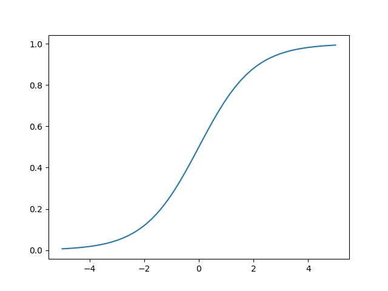
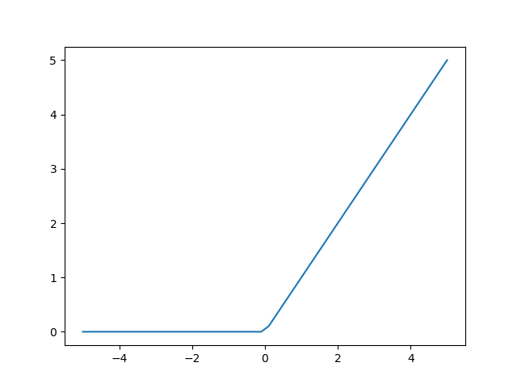

## 4.5 活性化関数
- 活性化関数がないと，ニューロンの演算は単なる積の総和になってしまうため，ニューラルネットワークから複雑な表現をする力が失われてしまう．

### 4.5.1 ステップ関数
- ステップ関数は，次のようなグラフで表されるステップ状の関数：

- 関数への入力 $x$ が0以下の場合は出力が0，$x$ が0より大きい場合は $y$ は1となる．
- これを数式で表すと次のようになる：

$$
y = \left\{\begin{array}{ll}
{0} & {(x \leq 0)} \\ 
{1} & {(x > 0)}
\end{array}\right.．
$$

- ステップ関数を用いると，ニューロンの興奮状態を0か1でシンプルに表現することができる．
- 実装が簡単ではある一方，0と1の中間の状態を表現できないというデメリットもある．
- ステップ関数は，ニューラルネットワークの起源であるパーセプトロンで用いられてきた．
- パーセプトロンはニューラルネットワークの一種と考えることもできるが，すべての信号が0と1で表される，よりシンプルなネットワーク．

 

### 4.5.2 シグモイド関数
- シグモイド関数は，次のようなグラフで表される0と1の間を滑らかに変化する関数：

- 関数への入力 $x$ が小さくなると関数の出力 $y$ は0に近づき，$x$ が大きくなると $y$ は1に近づく．
- シグモイド関数は，ネイピア数の累乗を表す $\exp$ を用いて次の式で表すことができる：
$$
y = \frac{1}{1+\exp(-x)} ．
$$

- この式において， $x$ の値が負になり0から離れると，分母が大きくなるため $y$ は0に近づく．
- また，$x$ の値が正になり0から離れると，$\exp(-x)$ が小さくなるため $y$ は1に近づく．
- シグモイド関数は，ステップ関数と比べて滑らかであり，0と1の中間を表現できる．
- また，シグモイド関数のメリットの1つに，微分が扱いやすいという特性がある．
- シグモイド関数の導関数は，$y'=\frac{dy}{dx}$ とすると，次のようになる：
$$
y' = (1-y)y ．
$$

- このように，シグモイド関数自体を用いたシンプルな演算で，簡単に微分値を求めることができる．
- この特性のために，シグモイド関数はニューラルネットワークで古くからよく使用されてきた．

 

### 4.5.4 ReLU
- ReLUはランプ関数とも呼ばれ，次のグラフで表される：

- $x>0$ の範囲でのみ立ち上がるのが特徴的な活性化関数．
- ReLUは次の式で表される：

$$
y = \left\{\begin{array}{ll}
{0} & {(x \leq 0)} \\ 
{x} & {(x > 0)}
\end{array}\right.．
$$

- シンプルであり，なおかつ層の数が多くなっても安定した学習ができるので，最近のディープラーニングでは主にこのReLUが出力層以外の活性化関数として用いられている．
- なお，ReLUの導関数は次の通り：

$$
y = \left\{\begin{array}{ll}
{0} & {(x \leq 0)} \\ 
{1} & {(x > 0)}
\end{array}\right.．
$$

- 微分値が $x$ の値によらず安定した値をとるのは，ReLUの大きなメリット． 

 

### 4.5.7 ソフトマックス関数
- ソフトマックス関数は，分類問題を扱うのに適した活性化関数．
- 活性化関数の出力を $y$，入力を $x$ とし，同じ層のニューロンの数を $n$ とすると，ソフトマックス関数は次の式で表される：

$$
y = \frac{\exp(x)}{\sum_{k=1}^{n}\exp(x_k)}．
$$

- この式で，右辺の分母 $\sum_{k=1}^{n}\exp(x_k)$ は，同じ層の各ニューロンへの入力 $x_k$ から $\exp(x_k)$ を計算し，足し合わせたもの．
- また，次の式で表されるように，同じ層のすべての活性化関数の出力を足し合わせると1になる：

$$
\sum_{l=1}^{n}(\frac{\exp(x_l)}{\sum_{k=1}^{n}\exp(x_k)}) = 
\frac{\sum_{l=1}^{n}\exp(x_l)}{\sum_{k=1}^{n}\exp(x_k)}
= 1．
$$

- これに加えて，指数関数には常に0より大きいという特性があるので，$0<y<1$となる．
- このため，ソフトマックス関数は，ニューロンが対応する枠に分類される確率を表現することができる．