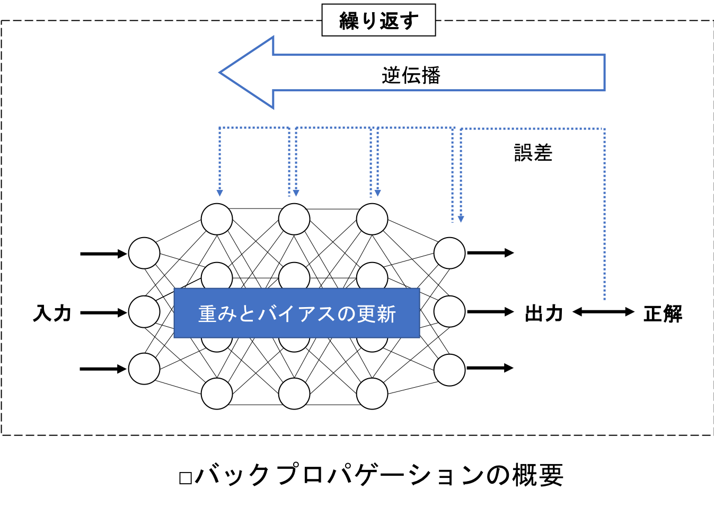

## 5.2 バックプロパゲーションとは？
- バックプロパゲーションは，ニューラルネットワークを学習させる際に用いられるアルゴリズムで，出力と正解の誤差がネットワークを逆伝播することにより，ネットワークの重みとバイアスを最適化する．
- バックプロパゲーションは，すべてのディープラーニングにおいて必要不可欠といっても過言ではない重要なアルゴリズム．

- 以下を繰り返すことで，次第にネットワークは誤差が最小になるように最適化されていき，学習が進行する：
   1. 順伝播により得られた出力と，あらかじめ用意された正解の誤差を，層を1つずつ遡るように逆伝播させる．
   2. 伝播した誤差をもとに各層で重みとバイアスの更新量を求める．
   3. すべての各層の重みとバイアスを少しずつ更新する．

 

### バックプロパゲーションの5つの要素
- <u>バックプロパゲーションを理解するためには，以下の5つの要素を抑える必要がある</u>：
   1. 訓練データとテストデータ
   2. 損失関数
   3. 勾配降下法
   4. 最適化アルゴリズム
   5. バッチサイズ

#### 1. 訓練データとテストデータ
- 使用する全データは，訓練データとテストデータに分割される：
   - 訓練データ：ニューラルネットワークの学習に用いる
   - テストデータ：学習結果の検証に使用する

#### 2. 損失関数
- ニューラルネットワークの複数の出力には，それぞれに正解がある．
- これらの複数の出力値と正解値から誤差を定義する．
- この誤差を定義するのは，損失関数と呼ばれる関数で，いくつかの種類がある．

#### 3. 勾配降下法
- 誤差を次々と前の層へ伝播させ，重みとバイアスを少しずつ更新して誤差を最小化する際に，勾配降下法というアルゴリズムを使う．

#### 4. 最適化アルゴリズム
- 勾配降下法において，重みとバイアスを繰り返し更新する最適化アルゴリズムには，確率的勾配降下法，AdaGradなど様々な種類がある．

#### 5. バッチサイズ
- 重みとバイアスの更新は，データのグループごとにおこなうが，このグループのサイズをバッチサイズという．
- バッチサイズの大小は，学習の効率に影響する．