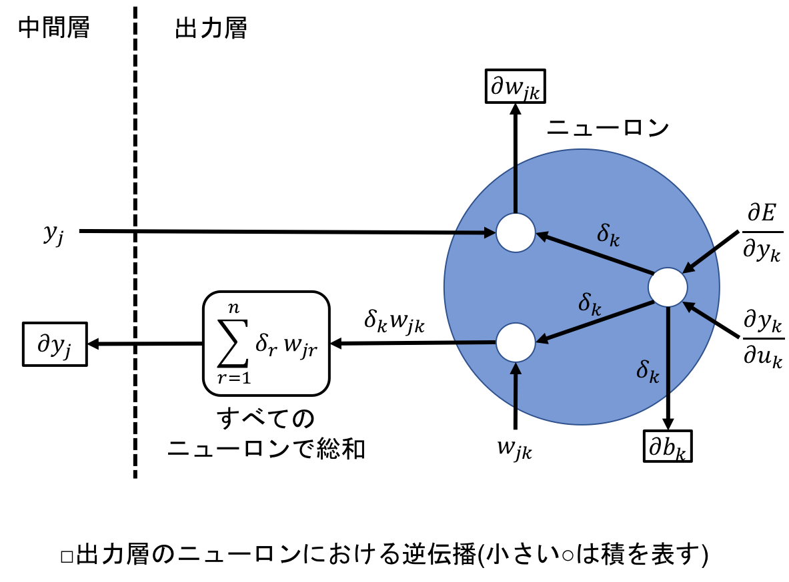

## 5.5 勾配降下法
- 誤差を次々と前の層へ伝播させて，重みとバイアスを少しずつ更新して最適化するために，勾配降下法というアルゴリズムを使用する．

### 5.5.1 勾配降下法の概要
- あるパラメータ $x_k$ の変化量に対する関数 $y(x1, x2,..., xk,...)$ の変化量の割合，すなわち，勾配 $\frac{\partial y}{\partial x_k}$ を求めて，この勾配に基づいてパラメータを調整し，$y$ を最適化するアルゴリズムを勾配法という．
- 勾配降下法は，勾配法の一種で，結果が $y$ の最小値に向かって降下するようにパラメータ $x_k$ を変化させる．
- <u>バックプロパゲーションにおいては，損失関数により求めた誤差の値を起点に，ニューラルネットワークを遡って重みとバイアスの修正をおこなっていくが，この際に勾配降下法を用いて修正量を決定する．</u>
- <u>勾配降下法では，誤差が小さくなるように，ニューラルネットワークの重みとバイアスを調整する．</u>
- バックプロパゲーションにおける勾配降下法のイメージを次に示す：

- 上記グラフでは，横軸の $w_{ij}$ がある重み，縦軸の $E$ が誤差．
- 重みの値に応じて誤差は変化するが，実際は関数の曲線の形状を知ることはできないため，足元の曲線の傾き（勾配）に応じて少しずつ重みを変化させていく．
- この際の各重みの変化量は，この曲線の傾き，すなわち勾配で決まる．（バイアスの場合も同様．）
- <u>したがって，ニューラルネットワークのすべての重みとバイアスを更新するために必要なことは，すべての重みとバイアスに対する，誤差の勾配を求めることになる．</u>

 

- なお．$w_{ij}$ の変化に対する $E$ の変化は，必ずしも先程のグラフのようなシンプルな曲線であるとは限らない．
- 次のように，局所的な最小値に囚われて，全体の最小値にたどり着くことができない場合もある：

- このような最小値を局所最適解という．それに対して，真の最小値を大域最適解という．
- 局所最適解を避けるためには様々な調整が必要になる．

 

- 勾配降下法による重みとバイアスの更新は，$w$ を重み，$b$ をバイアス，$E$ を誤差として，偏微分を用いた次の式で表すことができる：

$$
w \leftarrow w - \eta \frac{\partial E}{\partial w}
，b \leftarrow b - \eta \frac{\partial E}{\partial b}．
$$

- $\eta$ は学習係数と呼ばれる定数で，$\frac{\partial E}{\partial w}$ と $\frac{\partial E}{\partial b}$ が勾配．

 

- 学習係数は，学習の速度を決める定数．
- 0.1や0.01などの小さな値が使われることが多いが，小さすぎると学習に時間がかかりすぎたり，局所最適解に囚われてしまう，といった問題が発生する．
- しかし，学習係数が大きすぎても，誤差が収束しにくくなるという問題が発生する．
- そのため，効率よく大域最適解にたどり着くためには，学習係数を適切に設定する必要がある．

 

### 5.5.2 勾配の求め方の概要
- 勾配さえ求めれば，$w \leftarrow w - \eta \frac{\partial E}{\partial w}$ と $b \leftarrow b - \eta \frac{\partial E}{\partial b}$ に基づき，重みとバイアスを更新することができる．
- 次に示す3層のニューラルネットワークを想定し，各層の勾配を求める：

- 入力層は，入力を受け取り次の層に渡すのみなので，重みとバイアスはない．
- 3層のニューラルネットワークにおいて勾配を求めることができれば，それ以上層の数が増えても対応することができる．
- 以降では，次の表のように各層におけるニューロンの添字とニューロン数を設定する：

|層|添字|ニューロン数|
|:-:|:-:|:-:|
|入力層|$i$|$l$|
|中間層|$j$|$m$|
|出力層|$k$|$n$|

 

### 5.5.3 出力層の勾配
- $w_{jk}$ を出力層における重み，$b_k$ をバイアス，$u_k$ を重みと入力の積の総和にバイアスを加えた値とする．
- 重みには，中間層の出力が関わるので，添字は $j$ と $k$ の2つが必要になる．
- 中間層のニューロンの出力を $y_j$ とする．

#### 重みの勾配 $(\partial w_{jk} = \frac{\partial E}{\partial w_{jk}})$ の求め方
- まずは重みの勾配，すなわち $\frac{\partial E}{\partial w_{jk}}$ を求める．以降は，重みの勾配を $\partial w_{jk}$ とシンプルに表記する．
- 重みの勾配は，以下のように展開できる：
$$
\partial w_{jk} 
= \frac{\partial E}{\partial w_{jk}}
= \frac{\partial E}{\partial u_k} \frac{\partial u_k}{\partial w_{jk}}．
\tag{5-5}
$$

- ここで，右辺の $\frac{\partial u_k}{\partial w_{jk}}$ の部分は，$y_j$ が中間層の出力（出力層への入力），$b_k$ がバイアスなので，次のように表せる：
$$
\frac{\partial u_k}{\partial w_{jk}}
= \frac{\partial (\sum_{q=1}^{m} y_q w_{qk} + b_k)}{\partial w_{jk}}
= y_j．
\tag{5-6}
$$

- 右辺の $\frac{\partial E}{\partial w_{jk}}$ の部分は，出力層のニューロンの出力を $y_k$ とすると連鎖律により次のようになる：
$$
\frac{\partial E}{\partial u_k}
= \frac{\partial E}{\partial y_k} \frac{\partial y_k}{\partial u_k}．
$$

- <u>すなわち，誤差 $\partial E$ を出力層のニューロンの出力 $y_k$ で偏微分したものと，その出力 $y_k$ を $u_k$ で偏微分したものの積になる．</u>
- <u>前者は，損失関数を偏微分することで求めることができ，後者は活性化関数を偏微分することで求めることができる．</u>
- ここで，次のように $\delta_k$ を定義しておく：
$$
\delta_k 
= \frac{\partial E}{\partial u_k}
= \frac{\partial E}{\partial y_k} \frac{\partial y_k}{\partial u_k}．
\tag{5-7}
$$

- 式$(5 \text{-} 6), (5 \text{-} 7)$により，式$(5 \text{-} 5)$は次の形になる：
$$
\partial w_{jk} = y_j \delta_k．
$$

#### バイアスの勾配 $(\partial b_k = \frac{\partial E}{\partial b_k})$ の求め方
- バイアスの勾配も同様にして求めることができる．バイアスの勾配も，以下のように $\partial b_k$ とシンプルに表記する：
$$
\partial b_k 
= \frac{\partial E}{\partial b_k}．
$$

- 連鎖律により，以下の関係が成り立つ：
$$
\partial b_k
= \frac{\partial E}{\partial b_k}
= \frac{\partial E}{\partial u_k} \frac{\partial u_k}{\partial b_k}．
\tag{5-8}
$$

- このとき，右辺の $\frac{\partial u_k}{\partial b_k}$ の部分は次のようになる：
$$
\frac{\partial u_k}{\partial b_k}
= \frac{\partial (\sum_{q=1}^{m} y_q w_{qk} + b_k)}{\partial b_k}
= 1．
$$

- 式$(5 \text{-} 8)$における $\frac{\partial E}{\partial u_k}$ の部分は，重みの勾配の場合と変わらないため，同様に $\delta_k$ とすると，上記の結果を踏まえて，式$(5 \text{-} 8)$は次の形になる：
$$
\partial b_k = 1 \cdot \delta_k = \delta_k．
$$

- このように，バイアスの場合，勾配は $\delta_k$ に等しくなる．

 

### 5.5.4 出力層における入力の勾配
- 出力層では，1つ上の中間層における演算のために，あらかじめ $\frac{\partial E}{\partial y_j}$，すなわち中間層の出力の勾配（=出力層の入力の勾配）を計算しておく（$\frac{\partial E}{\partial y_j}$は，以降$\partial y_j$と略記する）：
$$
\partial y_j
= \frac{\partial E}{\partial y_j}．
$$

- 出力層であらかじめ計算しておいた $\partial y_j$ は，中間層で重みとバイアスの勾配を求めるために使用する．
- $\partial y_j$ は，多変数の連鎖率により，以下のようにして求める（$\sum$の添字の$r$は総和のために便宜上使用しているだけで，特に意味はない）：
$$
\partial y_j
= \frac{\partial E}{\partial y_j}
= \sum_{r=1}^{n} \frac{\partial E}{\partial u_r} \frac{\partial u_r}{\partial y_j}．
\tag{5-9}
$$

- つまり，$\frac{\partial E}{\partial u_r} \frac{\partial u_r}{\partial y_j}$ を出力層のすべてのニューロンで足し合わせればいいことになる．
- $u_r$ は入力と重みにバイアスを足した値であるが，出力層のニューロンの数だけある．
- この式において，$\frac{\partial u_r}{\partial y_j}$は次のように求めることができる：
$$
\frac{\partial u_r}{\partial y_j}
= \frac{\partial (\sum_{q=1}^{m} y_q w_{qr} + b_r)}{\partial y_j}
= w_{jr}．
$$

- 以上に加えて，$\delta_r = \frac{\partial E}{\partial u_r}$ により，式$(5 \text{-} 9)$は以下のようになる：
$$
\partial y_j = \sum_{r=1}^{n} \delta_r w_{jr}．
$$

- $\partial y_j$ を $\delta_r$ と $w_{jr}$ の総和としてシンプルな形にまとめることができた．

 

### 5.5.5 中間層の勾配
#### 重みの勾配 $(\partial w_{ij} = \frac{\partial E}{\partial w_{ij}})$ の求め方
- $w_{ij}$ を中間層の重み，$b_j$ をバイアス，$u_j$ を重みと入力の積にバイアスを加えた値とする．また，入力層の出力を $y_i$ とする．
- 中間層では，出力層の場合と同様に以下の関係が成り立つ（$\partial w_{ij}$ は重みの勾配）：
$$
\partial w_{ij}
= \frac{\partial E}{\partial w_{ij}}
= \frac{\partial E}{\partial u_j} \frac{\partial u_j}{\partial w_{ij}}．
\tag{5-10}
$$

- 式$(5 \text{-} 10)$において，右辺の $\frac{\partial u_j}{\partial w_{ij}}$ の部分は次のようになる：
$$
\frac{\partial u_j}{\partial w_{ij}}
= \frac{\partial (\sum_{p=1}^{l} y_p w_{pj} + b_j)}{\partial w_{ij}}
= y_i．
\tag{5-11}
$$

- これは出力層の場合と同様（添字の $p$ は便宜上．）．
- 次に，式$(5 \text{-} 10)$の右辺の $\frac{\partial E}{\partial u_j}$ の部分は，連鎖律により次のようになる：
$$
\frac{\partial E}{\partial u_j}
= \frac{\partial E}{\partial y_j} \frac{\partial y_j}{\partial u_j}．
\tag{5-12}
$$

- 式$(5 \text{-} 12)$の $\frac{\partial y_j}{\partial u_j}$ の部分は，活性化関数の微分により求めることができる．
- $\frac{\partial E}{\partial y_j}$ の部分は中間層の出力の勾配だが，これは以前に出力層で求めた $\partial y_j$ のこと．
- この $\partial y_j$ を用いて，式$(5 \text{-} 12)$を以下のように $\delta$ として表す：
$$
\delta_j
= \frac{\partial E}{\partial u_j}
= \partial y_j \frac{\partial y_j}{\partial u_j}．
\tag{5-13}
$$

- <u>このように，$\delta_j$ を求めるためには，出力層で求めた $\partial y_j$ を使用する（ニューラルネットワークを遡っている）．</u>
- 式$(5 \text{-} 10)$の右辺に，式$(5 \text{-} 11)$と式$(5 \text{-} 13)$を代入すると，以下のように表すことができる：
$$
\partial w_{ij}
= \delta_j y_i
$$

- 出力層の場合と同様，シンプルな形に重みの勾配をまとめることができた．

 

#### バイアスの勾配 $(\partial b_j = \frac{\partial E}{\partial b_j})$ の求め方
- バイアスの勾配 $\partial b_j$ は，連鎖律を用いて次のように表すことができる：
$$
\partial b_j
= \frac{\partial E}{\partial b_j}
= \frac{\partial E}{\partial u_j} \frac{\partial u_j}{\partial b_j}．
\tag{5-14}
$$

- ここで，右辺の $\frac{\partial u_j}{\partial b_j}$ の部分は次のようになる：
$$
\frac{\partial u_j}{\partial b_j}
= \frac{\partial (\sum_{p=1}^{l} y_p w_{pj} + b_j)}{\partial b_j}
= 1．
$$

- この式と式$(5 \text{-} 13)$により，式$(5 \text{-} 14)$を次のように表すことができる：
$$
\partial b_j
= \delta_j \cdot 1 = \delta_j．
$$

- 以上で，バイアスの勾配を求めることができた．出力層と同じように，勾配は $\delta_j$ に等しくなる．

 

- この層の上にさらに中間層がある場合は，以下のようにして $\partial y_i$ を求めて伝播させる：
$$
\partial y_i = \sum_{q=1}^{m} \delta_q w_{iq}．
$$

 

### 5.5.6 勾配を求める式のまとめ
- 各層で求めるべき値は，以下の通り：

#### 出力層
$$
\delta_k = \frac{\partial E}{\partial u_k}
= \frac{\partial E}{\partial y_k} \frac{\partial y_k}{\partial u_k}，
\tag{5-15}
$$

$$
\partial w_{jk} = y_j \delta_k，
\tag{5-16}
$$

$$
\partial b_k = \delta_k，
\tag{5-17}
$$

$$
\partial y_j = \sum_{r=1}^{n} \delta_r w_{jr}．
\tag{5-18}
$$

- $\delta_k$ の求め方は，損失関数と活性化関数の組み合わせごとに異なる．
- $\delta_k$ の数は出力層のニューロン数と同じ．
- 出力層のニューロンにおける逆伝播を図で表すと，次のようになる：

- 中間層では，$\delta_j$ を求めるのに出力層で求めた $\partial y_j$ を使用する．（誤差が伝播している．）

 

#### 中間層
$$
\delta_j = \frac{\partial E}{\partial u_j}
= \partial y_j \frac{\partial y_j}{\partial u_j}，
\tag{5-19}
$$

$$
\partial w_{ij} = y_i \delta_j，
\tag{5-20}
$$

$$
\partial b_j = \delta_j，
\tag{5-21}
$$

$$
\partial y_i = \sum_{q=1}^{m} \delta_q w_{iq}．
\tag{5-22}
$$

- $\delta$ の求め方以外は，出力層，中間層ともに同じ式．
- 中間層のニューロンにおける逆伝播を図で表すと，次のようになる：

- 中間層の数が増えたとしても，同じように $\partial y$ を伝播させて，増えた層の各勾配を計算することができる．

 

### 5.5.7 勾配の求め方 ─回帰─
- 損失関数と活性化関数を次のように設定する．

|項目|内容|
|:-:|:-:|
|損失関数|二乗和誤差|
|中間層の活性化関数|シグモイド関数|
|出力層の活性化関数|恒等関数|

 

#### 出力層において計算すべき勾配
- まずは，出力層の重みの勾配を導出する．そのためには，最初に $\delta_k$ を求める．
- 今回は，$\delta_k$ を求めるために式$(5 \text{-} 15)$を次の形で使用する：
$$
\delta_k = \frac{\partial E}{\partial y_k} \frac{\partial y_k}{\partial u_k}．
\tag{5-23}
$$

- 式$(5 \text{-} 23)$において，まずは $\frac{\partial E}{\partial y_k}$ を求める．これは，損失関数である二乗和誤差を出力 $y_k$ で偏微分することにより求めることができる（係数の $\frac{1}{2}$ が，2を打ち消すために活躍している．）：
$$
\frac{\partial E}{\partial y_k}
= \frac{\partial}{\partial y_k}(\frac{1}{2} \sum_{k} (y_k-t_k)^2)
= y_k - t_k．
\tag{5-24}
$$

- 次に，$\frac{\partial y_k}{\partial u_k}$ を求める．これは，出力層の活性化関数を偏微分することで求めることができる：
$$
\frac{\partial y_k}{\partial u_k}
= \frac{\partial u_k}{\partial u_k} = 1．
$$

- この式と式$(5 \text{-} 24)$を用いて，式$(5 \text{-} 23)$は次のようになる：
$$
\delta_k = y_k - t_k．
$$

- 以上により，式$(5 \text{-} 16)$，式$(5 \text{-} 17)$，式$(5 \text{-} 18)$，およびこの $\delta_k$ を合わせて，出力層において計算すべき各勾配を次のようにまとめることができる：
$$
\delta_k = y_k - t_k，
\tag{5-25}
$$

$$
\partial w_{jk} = y_j \delta_k，
$$

$$
\partial b_k = \delta_k，
$$

$$
\partial y_j = \sum_{r=1}^{n} \delta_r w_{jr}．
$$

 

#### 中間層において計算すべき勾配
- 次に，中間層の勾配を求める．中間層の場合も，最初に $\delta_j$ を求める．
- $\delta_j$ を求めるためには，式$(5 \text{-} 19)$を使用する：
$$
\delta_j
= \partial y_j \frac{\partial y_j}{\partial u_j}．
\tag{5-26}
$$

- 式$(5 \text{-} 26)$の $\frac{\partial y_j}{\partial u_j}$ は，活性化関数を偏微分して求めることができる：
$$
\frac{\partial y_j}{\partial u_j}
= (1-y_j)y_j．
$$

- この式を式$(5 \text{-} 26)$に代入すると，$\delta_j$ を次のように表すことができる：
$$
\delta_j
= \partial y_j (1-y_j)y_j．
$$

- 以上により，式$(5 \text{-} 20)$，式$(5 \text{-} 21)$，式$(5 \text{-} 22)$，およびこの $\delta_j$ を合わせて，中間層において計算すべき各勾配を次のようにまとめることができる：
$$
\delta_j = \partial y_j (1-y_j)y_j，
\tag{5-27}
$$

$$
\partial w_{ij} = y_i \delta_j，
$$

$$
\partial b_j = \delta_j，
$$

$$
\partial y_i = \sum_{q=1}^{m} \delta_q w_{iq}．
$$