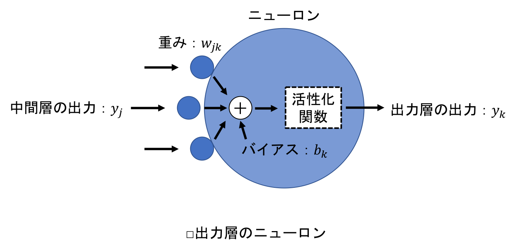

## 5.5 勾配降下法
- 誤差を次々と前の層へ伝播させて，重みとバイアスを少しずつ更新して最適化するために，勾配降下法というアルゴリズムを使用する．

### 5.5.1 勾配降下法の概要
- あるパラメータ $x_k$ の変化量に対する関数 $y(x1, x2,..., xk,...)$ の変化量の割合，すなわち，勾配 $\frac{\partial y}{\partial x_k}$ を求めて，この勾配に基づいてパラメータを調整し，$y$ を最適化するアルゴリズムを勾配法という．
- 勾配降下法は，勾配法の一種で，結果が $y$ の最小値に向かって降下するようにパラメータ $x_k$ を変化させる．
- <u>バックプロパゲーションにおいては，損失関数により求めた誤差の値を起点に，ニューラルネットワークを遡って重みとバイアスの修正をおこなっていくが，この際に勾配降下法を用いて修正量を決定する．</u>
- <u>勾配降下法では，誤差が小さくなるように，ニューラルネットワークの重みとバイアスを調整する．</u>
- バックプロパゲーションにおける勾配降下法のイメージを次に示す：

- 上記グラフでは，横軸の $w_{ij}$ がある重み，縦軸の $E$ が誤差．
- 重みの値に応じて誤差は変化するが，実際は関数の曲線の形状を知ることはできないため，足元の曲線の傾き（勾配）に応じて少しずつ重みを変化させていく．
- この際の各重みの変化量は，この曲線の傾き，すなわち勾配で決まる．（バイアスの場合も同様．）
- <u>したがって，ニューラルネットワークのすべての重みとバイアスを更新するために必要なことは，すべての重みとバイアスに対する，誤差の勾配を求めることになる．</u>

 

- なお．$w_{ij}$ の変化に対する $E$ の変化は，必ずしも先程のグラフのようなシンプルな曲線であるとは限らない．
- 次のように，局所的な最小値に囚われて，全体の最小値にたどり着くことができない場合もある：

- このような最小値を局所最適解という．それに対して，真の最小値を大域最適解という．
- 局所最適解を避けるためには様々な調整が必要になる．

 

- 勾配降下法による重みとバイアスの更新は，$w$ を重み，$b$ をバイアス，$E$ を誤差として，偏微分を用いた次の式で表すことができる：

$$
w \leftarrow w - \eta \frac{\partial E}{\partial w}
，b \leftarrow b - \eta \frac{\partial E}{\partial b}．
$$

- $\eta$ は学習係数と呼ばれる定数で，$\frac{\partial E}{\partial w}$ と $\frac{\partial E}{\partial b}$ が勾配．

 

- 学習係数は，学習の速度を決める定数．
- 0.1や0.01などの小さな値が使われることが多いが，小さすぎると学習に時間がかかりすぎたり，局所最適解に囚われてしまう，といった問題が発生する．
- しかし，学習係数が大きすぎても，誤差が収束しにくくなるという問題が発生する．
- そのため，効率よく大域最適解にたどり着くためには，学習係数を適切に設定する必要がある．

 

### 5.5.2 勾配の求め方の概要
- 勾配さえ求めれば，$w \leftarrow w - \eta \frac{\partial E}{\partial w}$ と $b \leftarrow b - \eta \frac{\partial E}{\partial b}$ に基づき，重みとバイアスを更新することができる．
- 次に示す3層のニューラルネットワークを想定し，各層の勾配を求める：

- 入力層は，入力を受け取り次の層に渡すのみなので，重みとバイアスはない．
- 3層のニューラルネットワークにおいて勾配を求めることができれば，それ以上層の数が増えても対応することができる．
- 以降では，次の表のように各層におけるニューロンの添字とニューロン数を設定する：

|層|添字|ニューロン数|
|:-:|:-:|:-:|
|入力層|$i$|$l$|
|中間層|$j$|$m$|
|出力層|$k$|$n$|

 

### 5.5.3 出力層の勾配
- $w_{jk}$ を出力層における重み，$b_k$ をバイアス，$u_k$ を重みと入力の積の総和にバイアスを加えた値とする．
- 重みには，中間層の出力が関わるので，添字は $j$ と $k$ の2つが必要になる．
- 中間層のニューロンの出力を $y_j$ とする．

- まずは重みの勾配，すなわち $\frac{\partial E}{\partial w_{jk}}$ を求める．以降は，重みの勾配を $\partial w_{jk}$ とシンプルに表記する．
- 重みの勾配は，以下のように展開できる：
$$
\partial w_{jk} 
= \frac{\partial E}{\partial w_{jk}}
= \frac{\partial E}{\partial u_k} \frac{\partial u_k}{\partial w_{jk}}．
\tag{5-5}
$$

- ここで，右辺の $\frac{\partial u_k}{\partial w_{jk}}$ の部分は，$y_j$ が中間層の出力（出力層への入力），$b_k$ がバイアスなので，次のように表せる：
$$
\frac{\partial u_k}{\partial w_{jk}}
= \frac{\partial (\sum_{q=1}^{m} y_q w_{qk} + b_k)}{\partial w_{jk}}
= y_j．
\tag{5-6}
$$

- 右辺の $\frac{\partial E}{\partial w_{jk}}$ の部分は，出力層のニューロンの出力を $y_k$ とすると連鎖律により次のようになる：
$$
\frac{\partial E}{\partial u_k}
= \frac{\partial E}{\partial y_k} \frac{\partial y_k}{\partial u_k}．
$$

- <u>すなわち，誤差 $\partial E$ を出力層のニューロンの出力 $y_k$ で偏微分したものと，その出力 $y_k$ を $u_k$ で偏微分したものの積になる．</u>
- <u>前者は，損失関数を偏微分することで求めることができ，後者は活性化関数を偏微分することで求めることができる．</u>
- ここで，次のように $\delta_k$ を定義しておく：
$$
\delta_k 
= \frac{\partial E}{\partial u_k}
= \frac{\partial E}{\partial y_k} \frac{\partial y_k}{\partial u_k}．
\tag{5-7}
$$

- 式$(5 \text{-} 6), (5 \text{-} 7)$により，式$(5 \text{-} 5)$は次の形になる：
$$
\partial w_{jk} = y_j \delta_k．
$$

 

### 5.5.4 出力層における入力の勾配

 

### 5.5.5 中間層の勾配

 

### 5.5.6 勾配を求める式のまとめ

 

### 5.5.7 勾配の求め方 ─回帰─

 

### 5.5.8 勾配の求め方 ─分類─