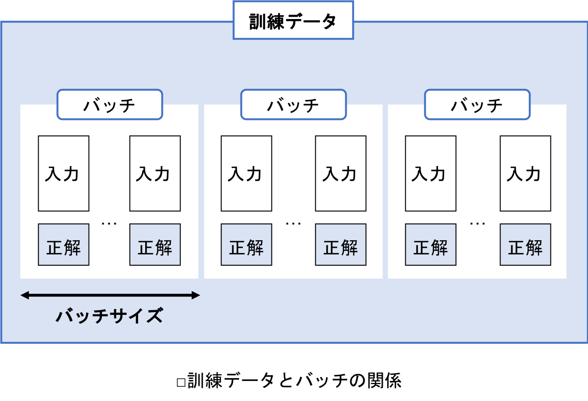

## 5.7 バッチサイズ
- バッチサイズとは，重みとバイアスの更新をおこなう間隔のこと．
- 学習の効率に大きく影響するため重要．

### 5.7.1 エポックとバッチ
- <u>すべての訓練データを1回学習することを，1エポック(epoch)と数える．</u>
- 訓練データのサンプル（入力と正解のペア）は複数まとめて学習に使うが，このサンプルのかたまりのことをバッチ(batch)という．
- 1エポックで使用する訓練データは，複数のバッチに分割される．

- バッチサイズは，このバッチに含まれるサンプル数のこと．
- バッチ内のすべてのサンプルを使用してから重みとバイアスの更新がおこなわれるため，バッチサイズは重みとバイアスの修正をおこなう間隔と表現することもできる．
- バッチサイズは，基本的に学習中ずっと一定．

 

### 5.7.2 バッチ学習
- <u>バッチ学習においては，バッチサイズが全訓練データの数になる．</u>
- 1エポックごとに全訓練データの誤差の平均を求め，重みとバイアスを更新する．
- 一般的に学習は安定しており，他の2つの学習タイプと比較して高速であるが，局所最適解に囚われやすいのが欠点．
- バッチ学習における誤差は，訓練データ数を $N$，個々のデータの誤差を $E_i$ として，以下のように定義できる：
$$
E = \frac{1}{N} \sum_{i=1}^{N} E_i．
$$

- また，重みの勾配は次のようにして求めることができる：
$$
\frac{\partial E}{\partial w} = \sum_{i=1}^{N} \frac{\partial E_i}{\partial w}．
$$

- 重みの勾配をバッチ内の個々のデータごとに計算し，それを合計すればいい．
- この計算は，行列演算により一度で効率的におこなうことができる．

 

### 5.7.3 オンライン学習
- オンライン学習では，バッチサイズが1になる．
- 個々のサンプルごとに，重みとバイアスが更新される．
- 個々のデータに振り回されるため，安定性に欠けるが，それががえって局所最適解にとらわれることを防いでくれる．

 

### 5.7.4 ミニバッチ学習
- バッチ学習とオンライン学習の中間にあるのがミニバッチ学習．
- 訓練データを小さなかたまり(バッチ)に分割し，この小さなかたまりごとに，重みとバイアスの更新をおこなう．
- バッチ学習よりもバッチのサイズが小さく，ランダムにバッチを選択するため，バッチ学習と比較して局所最適解に囚われにくい．
- また，オンライン学習よりもバッチサイズが大きいので，おかしな方向に学習するリスクを低減できる．
- ミニバッチ学習は，バッチ学習とオンライン学習のハイブリッド．

 

- ミニバッチ学習における誤差は，ミニバッチ学習のバッチサイズを $n(n \leq N)$ として以下のように定義される：
$$
E = \frac{1}{n} \sum_{i=1}^{n}E_i．
$$
- また，重みの勾配は次のようにして求めることができる：
$$
\frac{\partial E}{\partial w} = \sum_{i=1}^{n} \frac{\partial E_i}{\partial w}．
$$
- この勾配は，バッチ学習の場合と同様に行列演算を用いて一度に計算することができる．

 

- 例えば，訓練データのサンプル数が1000個の場合（1000個のサンプルを使い切ると1エポック）を考える：
   - <u>バッチ学習：バッチサイズは1000で，1エポックあたり1回重みとバイアスが更新される．</u>
   - <u>オンライン学習：バッチサイズは1で，1エポックあたり1000回更新がおこなわれる．</u>
   - <u>ミニバッチ学習：例えばバッチサイズを50に設定すると，1エポックあたり20回更新がおこなわれる．</u>
- バッチサイズを適切に設定することは難しい．
- 一般的には，10-100程度のバッチサイズを設定することが多い．