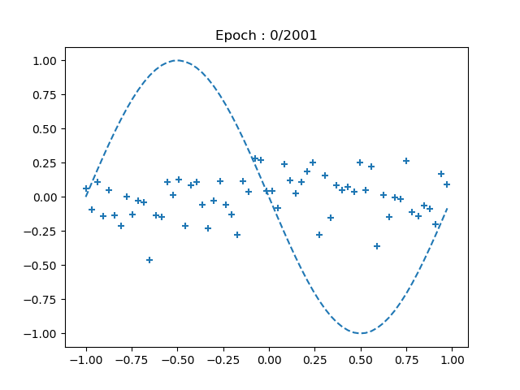
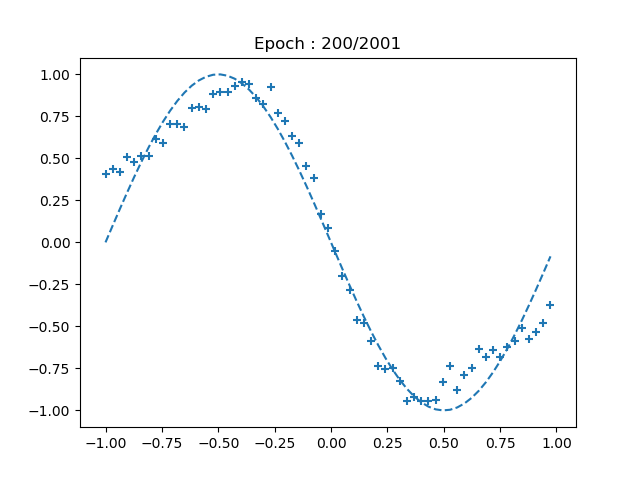
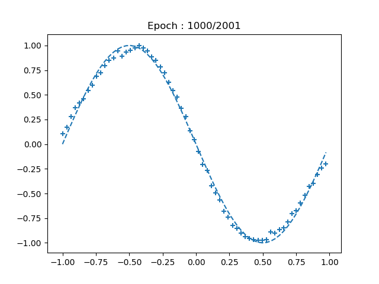
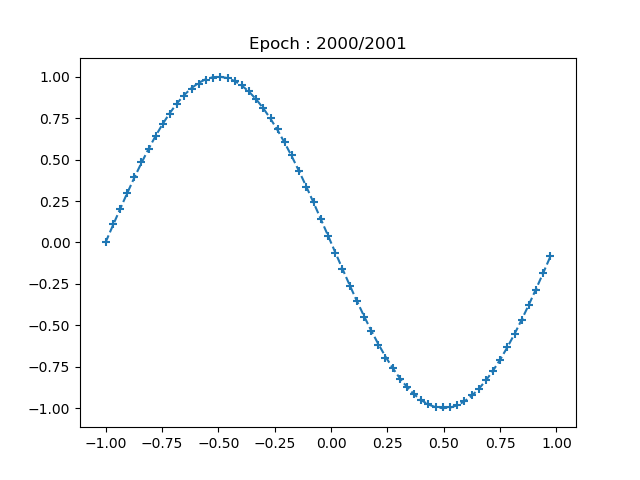

[](2019/09/21)

## 5.9 バックプロパゲーションの実装 ─回帰─
- ここでは，バックプロパゲーションによりネットワークが学習する仕組みを理解することを目的とするため，ニューロンや層の数が多くないシンプルなニューラルネットワークを構築する．

<br>

### 5.9.1 回帰の例 ─sin関数の学習─
- ニューラルネットワークにsin関数を学習させることを考える．
- x座標をネットワークへの入力，y座標をネットワークからの出力とする．
- sin関数は連続的な関数のため，このケースは回帰問題になる．
- 出力と正解の誤差を伝播させて，重みとバイアスを修正することを繰り返すことで，ネットワークは少しずつsin関数を学習していく．

<br>

- 今回は，入力層のニューロンが１つ，中間層のニューロンが３つ，出力層のニューロンが１つのシンプルなネットワークを使用する．
- その他設定は以下の通りとする：

|項目|内容|
|:-:|:-:|
|損失関数|二乗和誤差|
|中間層の活性化関数|シグモイド関数|
|出力層の活性化関数|恒等関数|
|最適化アルゴリズム|確率的勾配降下法|
|バッチサイズ|1|

<br>

### 5.9.2 出力層の実装
- 今回は，ニューラルネットワークの各層をクラスとして実装する．
- 以下は，出力層を表すクラス：
``` python
class OutputLayer:
    # 初期設定
    def __init__(self, n_upper, n):
        # 重み(行列)とバイアス(ベクトル)
        self.w = wb_width * np.random.randn(n_upper, n)
        self.b = wb_width * np.random.randn(n)

    # 順伝播
    def forward(self, x):
        self.x = x
        u = np.dot(x, self.w) + self.b
        self.y = u # 恒等関数

    # 逆伝播
    def backward(self, t):
        delta = self.y - t

        self.grad_w = np.dot(self.x.T, delta)
        self.grad_b = np.sum(delta, axis=0)

        self.grad_x = np.dot(delta, self.w.T)

    # 重みとバイアスの更新
    def update(self, eta):
        self.w -= eta * self.grad_w
        self.b -= eta * self.grad_b
```

- コンストラクタでは初期設定を行う．上の層のニューロン数(n_upper)，およびこの層のニューロン数(n)を引数として受け取り，重みとバイアスの初期値を設定する．
- 重みは n_upper × n の行列とし，バイアスは要素数3のベクトルとする．各要素の初期値は，NumPyの random.randn により正規分布に従う乱数を用いて，ランダムに設定する．（rand関数は引数が1つのときは指定した引数個の要素を持つ1次元配列を返し，2つ以上のときはその形状を持つ多次元配列を返す．）
- wb_width はその正規分布の広がり具合．
- forwardメソッドは順伝播のメソッドで，入力と重みの行列積にバイアスを足し合わせ，活性化関数により出力を計算する．
- backwardメソッドは逆伝播のメソッドで，正解を引数として受け取り，以前に導出した式に基づいて delta を計算する．この delta を用いて，重みの勾配 grad_w，バイアスの勾配 grad_b，この層への入力の勾配 grad_x を計算する．
- updateメソッドは重みとバイアスの更新用のメソッド．それぞれの勾配に学習係数 eta をかけて更新量とし，現在の値から引く．

<br>

### 5.9.3 中間層の実装
- 以下は，中間層を表すクラス：
``` python
class MiddleLayer:
    # 初期設定
    def __init__(self, n_upper, n):
        # 重み(行列)とバイアス(ベクトル)
        self.w = wb_width * np.random.randn(n_upper, n)
        self.b = wb_width * np.random.randn(n)

    # 順伝播
    def forward(self, x):
        self.x = x
        u = np.dot(x, self.w) + self.b
        self.y = 1/(1+np.exp(-u)) # シグモイド関数

    # 逆伝播
    def backward(self, grad_y):
        delta = grad_y * (1-self.y) * self.y # シグモイド関数の微分
        self.grad_w = np.dot(self.x.T, delta)
        self.grad_b = np.sum(delta, axis=0)

        self.grad_x = np.dot(delta, self.w.T)

    # 重みとバイアスの更新
    def update(self, eta):
        self.w -= eta * self.grad_w
        self.b -= eta * self.grad_b
```

- 出力層との違いは，活性化関数がシグモイド関数である点と，backwardメソッドで delta を求めるのに出力層と異なる式を使用している点の2つ．
- このクラスを用いれば，例えば以下のように中間層をいくつでもインスタンスとして生成することができる：
``` python
middle_layer_1 = MiddleLayer(3, 4)
middle_layer_2 = MiddleLayer(4, 5)
middle_layer_3 = MiddleLayer(5, 6)
```

<br>

### 5.9.4 バックプロパゲーションの実装
- 以下は，バックプロパゲーションによる学習のコード：
``` python
if __name__ == "__main__":
    # 各層の初期化
    middle_layer = MiddleLayer(n_in, n_mid)
    output_layer = OutputLayer(n_mid, n_out)

    # 学習
    for i in range(epoch):
        # インデックスをシャッフル
        index_random = np.arange(n_data)
        np.random.shuffle(index_random)

        # 結果の表示用
        total_error = 0
        plot_x = []
        plot_y = []

        for idx in index_random:
            x = input_data[idx:idx+1]      # 入力
            t = correct_data[idx:idx+1]    # 正解

            # 順伝播
            middle_layer.forward(x.reshape(1, 1)) # 入力を行列に変換
            output_layer.forward(middle_layer.y)

            # 逆伝播
            output_layer.backward(t.reshape(1, 1)) # 正解を行列に変換
            middle_layer.backward(output_layer.grad_x)

            # 重みとバイアスの更新
            middle_layer.update(eta)
            output_layer.update(eta)
        # end for
    # end for
```

- 各層は，クラスからインスタンス化したうえで使用する．その際に，1つ上の層のニューロン数とその層のニューロン数を引数として渡す．
- 学習はエポック数だけ繰り返される．エポックごとにシャッフルされたインデックスの配列が作成されるが，これを用いてランダムに入力と正解を input_data と correct_data から取り出す．
- 順伝播の計算では，入力は行列に変換する．今回はバッチサイズが1で入力層のニューロン数が1なので，入力はたった1つの数値だが，それでも reshape(1, 1) により行数1，列数1の行列に変換する．
- 逆伝播では出力層に正解を渡すが，これも行列に変換する．逆伝播によりすべての層の勾配を求めた後，updateメソッドで重みとバイアスを更新する．

<br>

### 5.9.6 実行結果

|Epoch : 0/2001|Epoch : 200/2001|Epoch : 1000/2001|Epoch : 2000/2001|
|:-:|:-:|:-:|:-:|
|||||

- 学習が進むにつれて，次第に点の集合がサインカーブに近づいていく様子を確認することができる．それに伴い，誤差も次第に小さくなる．
- 最小限の実装によるバックプロパゲーションを用いて，ニューラルネットワークに学習をさせることができた．
- <u>中間層のニューロン数が増えすぎても，計算量の増大や過学習の問題が発生する．</u>
- 今回のケースではベストな中間層のニューロン数は3．