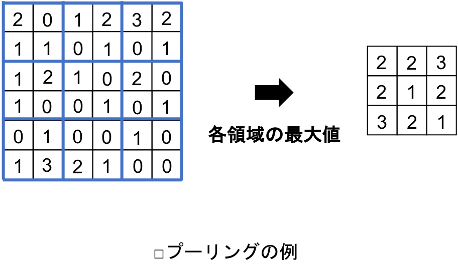
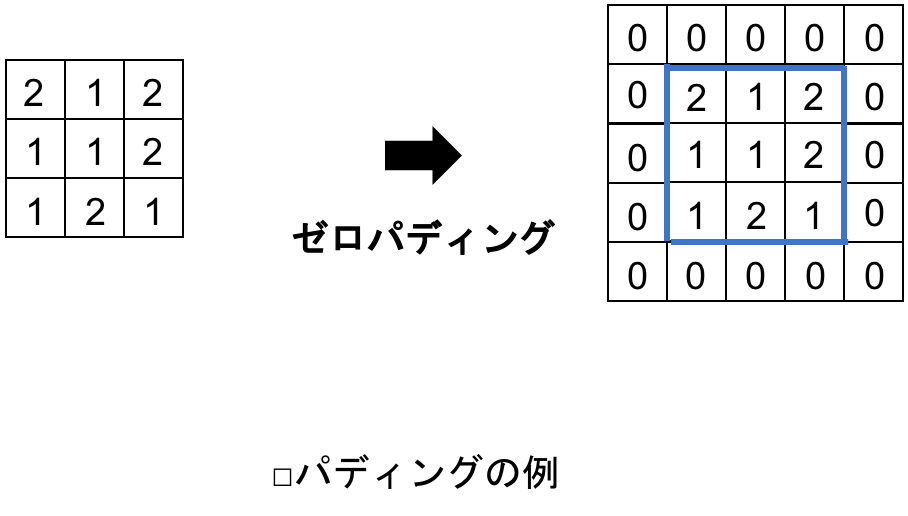
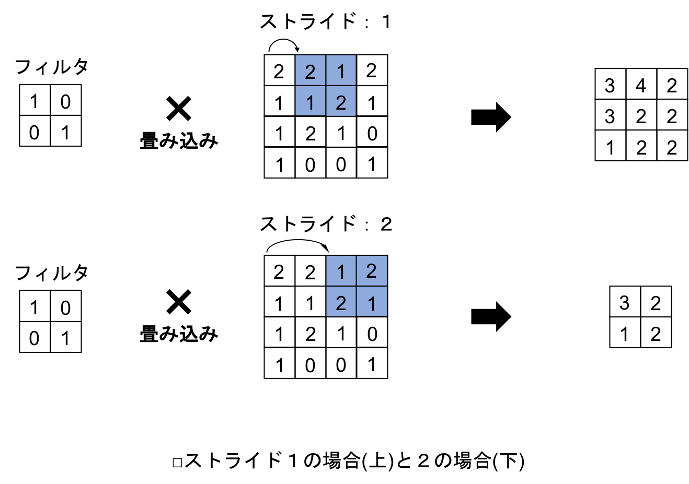

## 7.1 畳み込みニューラルネットワーク(CNN)の概要
- 畳み込みニューラルネットワーク（以降はCNN）は，ヒトの視覚のように画像認識を得意とする．
- 次の図はCNNの例だが，CNNは画像を入力とした分類問題をよく扱う．
- この図においては，出力層の各ニューロンが各動物に対応し，出力の値がその動物である確率を表す．

- CNNには，畳み込み層，プーリング層，全結合層という名前の層が登場する．
- 例えば，猫の写真を学習済みのCNNに入力すると，90%でネコ，5%でイヌ，3%でウサギ，1%でネズミ，のようにその物体が何である確率が最も高いかを教えてくれる．

 

- CNNには，画像を柔軟に精度よく認識するために，通常のニューラルネットワークとは異なる仕組みが備わる．
- 畳み込み層では，出力が入力の一部の影響しか受けない局所性の強い処理がおこなわれる．
- また，プーリング層においては，認識する対象の位置に柔軟に対応できる仕組みが備わる．

 

### 7.1.2 CNNの構造
- 複数の層で構成されている点はこれまでに扱ったニューラルネットワークと同様．
- <u>CNNの場合は，層に畳み込み層，プーリング層，全結合層の3種類がある．</u>
- <u>画像は，畳み込み層に入力されるが，畳み込み層とプーリング層は何度か繰り返されて，全結合層につながる．</u>
- 全結合層も何度か繰り返されて，最後の全結合層は出力層になる．

 

- 畳み込み層では，入力された画像に対して複数のフィルタ処理をおこない，画像の特徴を表す複数の画像に変換する．</u>
- <u>プーリング層では，画像の特徴を損なわないように画像のサイズを縮小する処理をおこなう．</u>
- 全結合層では，これまで扱ってきたニューラルネットワークの層と同じように，層間のすべてのニューロンが接続される．

 

### 7.1.3 畳み込み層
- 画像に対して畳み込みをおこなうことで，画像のある特徴を強めたり弱めたりすることができる．
- <u>畳み込み層では，この畳込み処理により，入力画像をより特徴が強調されたものに変換する．</u>

 

- また，画像には局所性という性質がある．
- <u>局所性とは，各ピクセルが近傍のピクセルと強い関連性を持っている性質のこと．</u>
- 例えば，ある隣り合ったピクセル同士は似たような色になる可能性が高く，複数のピクセルからなるかたまりが物体の輪郭を構成することもある．
- <u>畳み込み層は，このような画像の局所性を利用して画像の特徴を抽出する．</u>

 

- 畳み込み層では，複数のフィルタを用いて特徴の抽出がおこなわれる．
- 次の図に，畳み込み層における，フィルタを用いた畳込み処理の例を示す：

- 畳み込みでは，フィルタを入力画像の各位置にずらして，重なったピクセル同士の値を掛け合わせる．
- そして掛け合わせた値を位置ごとに足し合わせて，新たなピクセルとする．
- 結果として，畳み込みにより3×3の新たな画像が生成される．

 

- 畳み込みをおこなうと，元の画像よりもサイズが小さくなる．
- 上記の例では，4×4の画像に2×2のフィルタをかけて3×3の画像が生成されている．

 

- 実用的なCNNでは，次のように複数のチャンネルを持つ画像に対して複数のフィルタを用いた畳み込みをおこなう：

- チャンネル数は3でフィルタの数は4だが，各フィルタは入力画像と同じだけのチャンネル数を持っている．
- 例えば，入力画像がRGBであれば，各フィルタにはそれぞれ3つのチャンネルが必要になる．
- <u>各フィルタにおいて，チャンネルごとに畳み込みをおこない３つの画像を得るが，これらの画像の各ピクセルを足し合わせて1つの画像にする．</u>
- フィルタごとにこの処理をおこなった結果，生成される画像の枚数はフィルタの数と同じになる．

 

- <u>畳み込みにより生成された画像の各ピクセルには，バイアスを足して活性化関数で処理する．</u>
- <u>なお，バイアスは，1つのフィルタあたり1つの値をとる．</u>
- <u>すなわち，フィルタの数とバイアスの数は同じになる．</u>

- <u>この場合，チャンネル数が3の画像を畳み込み層に入力して，チャンネル数が4の画像を出力として得ている．</u>
- <u>畳み込みをおこなっているので，ここの画像のサイズは小さくなっている．</u>
- このような出力画像を，プーリング層や全結合層，あるいは他の畳み込み層に入力することになる．

 

- 次は，畳み込み層と全結合層のイメージの比較：

- <u>畳み込み層はフィルタごとに処理をおこなうため，全結合層と比べて層間の接続が局所的．</u>
- 局所的な特徴を捉えるのに適したネットワーク構造となっている．

 

### 7.1.4 プーリング層
- 通常，プーリング層は畳み込み層の直後に配置される．
- プーリング層では画像を各領域に区切り，各領域を代表する値を抽出し並べて新たな画像とする．
- このような処理をプーリング（pooling）という．

- 上図の場合は，各領域の最大値を，各領域を代表する値としている．このようなプーリングの方法を Max Pooling という．
- 他にも，領域の平均値を取る Average Pooling などの方法もある．
- CNNでは，Max Pooling がおこなわれることが多い．
- 以降では，プーリングという言葉は Max Pooling を指す．

 

- プーリングをおこなうと，画像が縮小される．
- プーリングは言わば画像をぼやかす処理なので，対象の位置の感度が低下する．
- これにより，対象の位置が多少変化しても，結果は同じようになる．
- <u>プーリング層は，位置の変化に対するロバスト性を与える．</u>
- <u>また，プーリング層により画像サイズが小さくなるので，計算量が削減される効果もある．</u>

 

### 7.1.5 全結合層
- <u>全結合層（fully connected layer）は，通常のニューラルネットワークで用いられる層のこと．</u>
- 通常，全結合層は畳み込み層とプーリング層を何度か繰り返したあとに配置される．
- <u>畳み込み層とプーリング層により抽出された特徴量に基づき，演算をおこない，結果を出力する．</u>

 

- <u>全結合層に入力する場合は，画像を平坦なベクトルに変換する．</u>
- <u>例えば，出力の画像の高さが $\rm H$，幅が $\rm W$，チャンネル数が $\rm F$ である場合，全結合層の入力は，サイズが $\rm H \times \rm W \times \rm F$ のベクトルになる．</u>
- 逆伝播の場合は，反対に，サイズが $\rm H \times \rm W \times \rm F$ のベクトルが，高さが $\rm H$，幅が $\rm W$，チャンネル数が $\rm F$ に変換される．

 

### 7.1.6 パディング
- 畳み込み層やプーリング層においてｍ入力画像を取り囲むようにピクセルを配置するテクニックをパディング（Padding）という．

- 上図では，画像の周囲に値が0のピクセルを配置している．
- CNNでは，ゼロパディングがよく使われる．

 

- パディングにより画像サイズが大きくなる
- 畳み込み層やプーリング層を経ると画像サイズが小さくなるので，幾重にもこれらの層を重ねると終いには画像サイズが1×1になってしまう．
- <u>パディングの目的の1つは，畳み込みを経ても画像サイズが変わらないようにすること．</u>

 

### 7.1.7 ストライド
- ストライド（Stride）は畳み込み層においてフィルタが移動する間隔のこと．
- これまでの例においてストライドはすべて1だったが，ストライドが2以上になる場合もある．

- ストライドが大きいとフィルタの移動距離が大きくなるので，生成される画像のサイズが小さくなる．
- そのため，大きすぎる画像を縮小するためにストライドが使われることもあるが，特徴を見逃す心配があるため通常はストライドを1に設定するのが望ましい．

 

### 7.1.8 CNNの学習
- CNNでは，通常のニューラルネットワークと同様に，逆伝播による学習がおこなわれる．
- <u>畳み込み層では，フィルタが学習により最適化される．</u>
- 出力と正解の誤差から伝播してきた値をもとにフィルタを構成する各値の勾配を計算し，フィルタが更新される．
- また，バイアスも同様に更新される．
- 誤差は畳み込み層を通ってさらに上の層に伝播する．
- <u>プーリング層では，学習はおこなわれない．</u>
- しかしながら，誤差はこの層を通過してさらに上の層に伝播することができる．
- 全結合層では，通常のニューラルネットワークと同じ方法で誤差の伝播がおこなわれる．
- 以上をまとめると，次の表になる：

|層|誤差の伝播|学習するパラメータ|
|:-:|:-:|:-:|
|畳み込み層|あり|フィルタ，バイアス|
|プーリング層|あり|なし|
|全結合層|あり|重み，バイアス|

 

### 7.1.9 変数の一覧
- 畳み込み層，プーリング層ともにおこなわれる処理で使用する変数の一覧を次に示す：

|変数名|解説|変数名|解説|
|:-:|:-:|:-:|:-:|
|$B$|バッチサイズ|$C$|入力画像のチャンネル数|
|$I_h$|入力画像の高さ|$I_w$|入力画像の幅|
|$M$|フィルタ数|$F_h$|フィルタの高さ|
|$F_w$|フィルタの幅|$O_h$|出力画像の高さ|
|$O_w$|出力画像の幅|$P$|プーリング領域のサイズ|