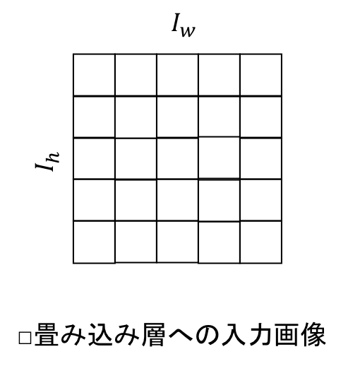
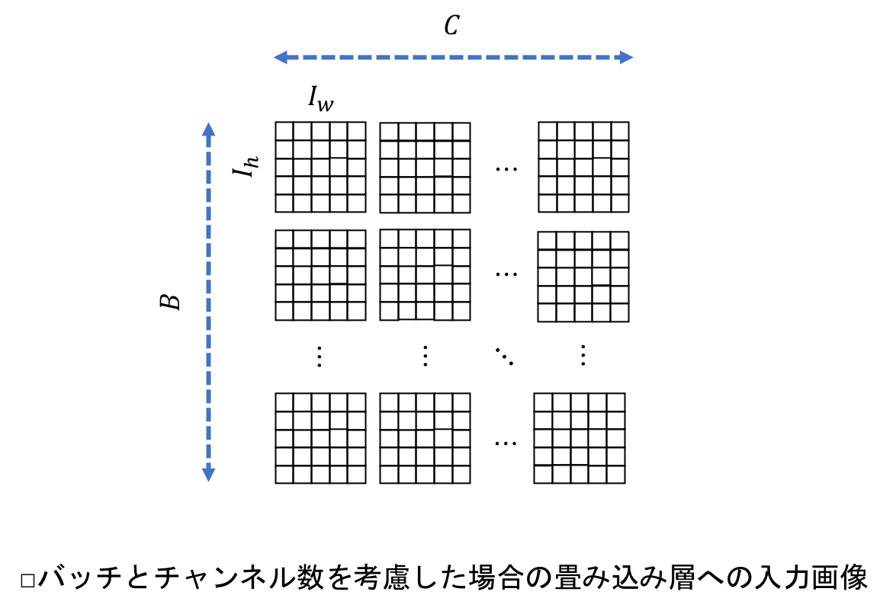
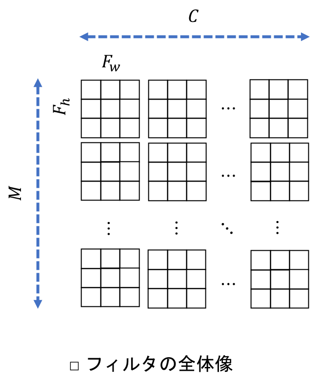
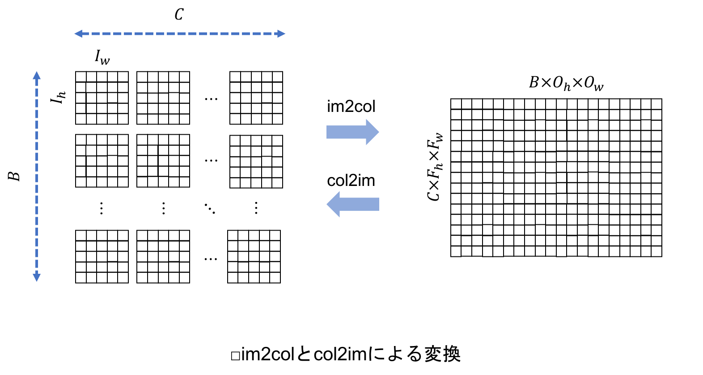
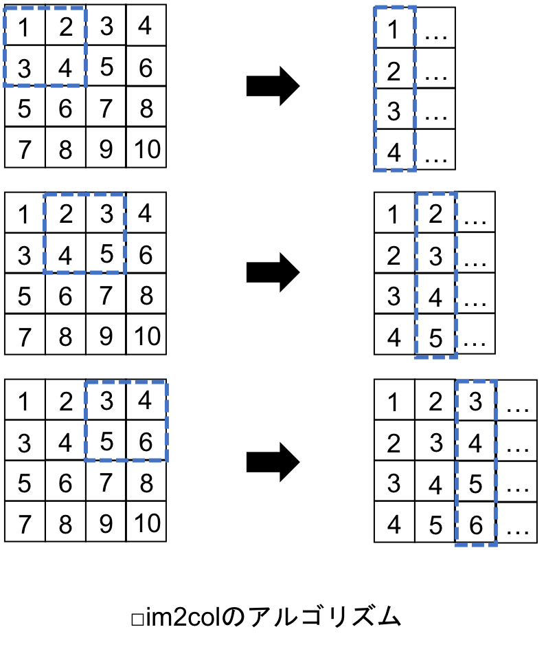
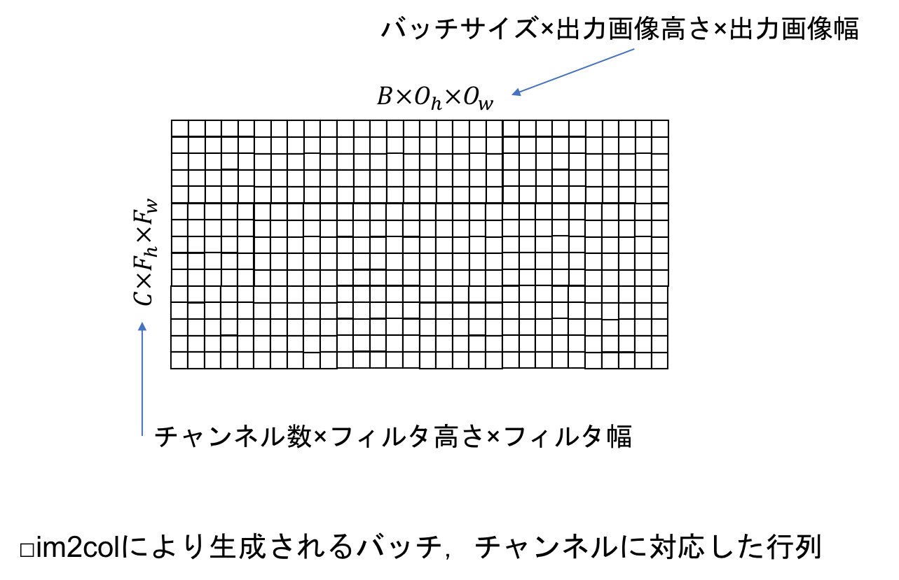
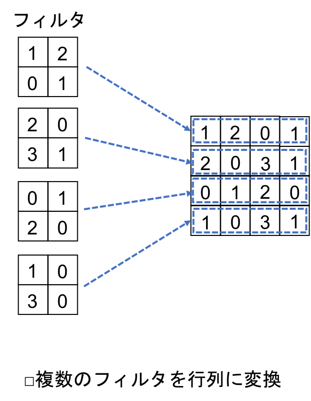
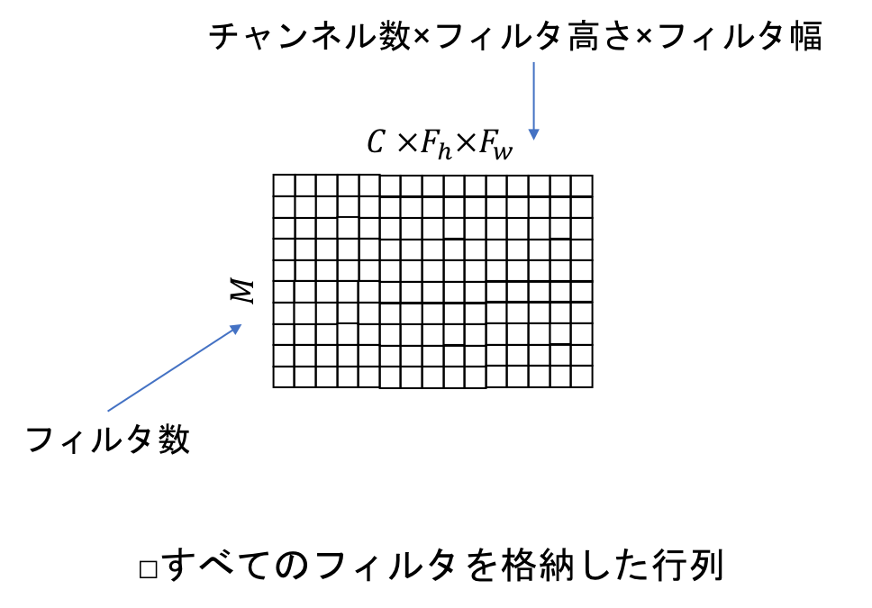
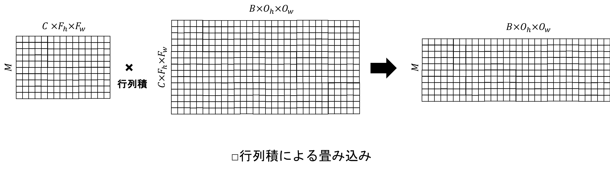

[](2019/05/13)

## 7.2 im2colとcol2im
- 畳み込み層とプーリング層のコードをシンプルに保ち，実行速度を早く保つために，im2colおよびcol2imというアルゴリズムを用いる．
- <u>im2colは，画像を表す4次元配列を行列に変換し，col2imは行列を，画像を表す4次元配列に変換する．</u>

### 7.2.1 im2colとcol2imの概要
- 畳み込み層への入力は，バッチとチャンネルを考慮しなければ，次のようなシンプルな行列で表すことができる：

<center>

</center>

- しかしながら，実際にはバッチ学習，ミニバッチ学習に対応する必要があり，複数のチャンネルを持つRGB画像を扱う必要もある．
- バッチ，チャンネルに対応した入力画像を次に示す（$C$：入力画像のチャンネル数，$B$：バッチサイズ）：

<center>

</center>

- 上図に示すように，入力画像は4次元配列，すなわち4階のテンソルになる．

<br>

- そして，フィルタは複数あり，それぞれのフィルタのチャンネル数は入力画像のチャンネル数と同じになる：

<center>

</center>

- 以上のように，畳み込み層を実装する際には多くの入り組んだ要素を考慮する必要があり，何重にも重なった多次元配列を扱う必要がある．
- <u>多次元配列をfor文などによるループで扱おうとすると，ループが幾重にもなりコードが複雑になってしまう．</u>
- <u>また，NumPyは，行列演算は高速だが，ループの実行にはとても時間がかかる．</u>
- そこで，ループを最小限に抑え，コードをシンプルに保つために用いるのが，im2colおよびcol2im：

<center>

</center>

- 順伝播の場合はim2col，逆伝播の場合はcol2imが用いられるが，これらのアルゴリズムにより実行時間のかかるループ処理を最小限に抑え，メインの計算を1つの行列積に集約させることが可能になる．
- im2colとcol2imは，プーリング層でも活用される．

<br>

### 7.2.2 im2colのアルゴリズム
- 畳み込みは，行列積として計算すると比較的シンプルなコードでおこなうことができる．
- <u>そのためには，入力画像を行列演算に適した形状に変形する必要があるが，im2colはその際に利用される．</u>
- また，プーリング層で各領域の最大値を抽出する際にも，im2colは利用される．
- im2colは簡潔さと実効速度で優れており，ディープラーニング用のライブラリ，ChainerやCaffeでも使用されている．

<br>

- im2colは，基本的に画像上の長方形の領域を行列の形に変換するアルゴリズム：

<center>

</center>

- 左上から右に領域をスライドさせて，領域の要素を行列の列に変換していく．
- 領域が一番右に達した場合，領域を1つ下にスライドして再び左から右にスライドさせる．
- この結果，画像の行列に変換することができる．
- バッチとチャンネルを考慮しない場合，im2colにより生成される行列の形状は，次のように $(F_hF_w, O_hO_w)$ となる：

<center>

</center>

- 次に，入力画像がバッチとチャンネルに対応している場合を考える．
- <u>フィルタはチャンネルの数だけあり，出力はバッチサイズの数だけあるので，チャンネル数を $C$，バッチサイズを $B$ とすると，im2colにより生成される行列の形状は $(CF_hF_w, BO_hO_w)$ となる．</u>：

<center>

</center>

- このように，im2colを用いることで，バッチとチャンネルに対応している場合でも，単一の行列で入力画像を表現することができる．
- この行列とフィルタで行列積を計算するために，複数のフィルタを次のようにして1つの行列に格納する：

<center>

</center>

- これをチャンネルに対応させると，すべてのフィルタを格納した行列は次のようになる：

<center>

</center>

- フィルタの数を $M$ とすると，行列の形状は $(M, CF_hF_w)$ となる．
- <u>この行列の列数 $CF_hF_w$ と，入力画像から生成した行列の行数 $CF_hF_w$ が一致することにより，行列積が可能となり，畳み込みの計算を一度に行うことができる．</u>
- この行列積を以下に示す：

<center>

</center>

- 行列積の前の行列における各行は個々のフィルタで，後ろの行列における各列はそれらのフィルタが重なる領域．
- <u>行列積により生成された行列の形状は $(M, BO_hO_w)$ だが，これを $(B, M, O_h, O_w)$ に変換することで，畳み込み層の出力の形状になる．</u>

<br>

### 7.2.3 im2colの実装 -シンプルなim2col-
- まずは，バッチやチャンネルを考慮しないケースを考える（チャンネル数が1，バッチサイズが1）．
- パディングはなしで，ストライドは1とする．
- この場合，im2colのコードは以下のようになる：
``` python
import numpy as np

def im2col(image, flt_h, flt_w, out_h, out_w):
    img_h, img_w = image.shape # 入力画像の高さ，幅

    # 生成される行列のサイズ
    cols = np.zeros( (flt_h*flt_w, out_h*out_w) )

    for h in range(out_h):
        h_lim = h + flt_h
        for w in range(out_w):
            w_lim = w + flt_w
            cols[:,h*out_w+w] = img[h:h_lim, w:w_lim].reshape(-1)
        # end for w
    # end for h

    return cols
```

- for文を用いて出力画像の高さと幅でループをおこない，入力画像からフィルタの領域`image[h:h_lim, w:w_lim]`をスライスしている．
- そして，スライスした領域を`reshape(-1)`により平坦にして，生成される行列`cols`の行に代入している．
- この場合，`h*out_w+w`が`cols`の行のインデックスになる．
- 以下では，4×4ピクセルの画像を作成して，im2col関数に渡している：
``` python
img = np.array( [   [1, 2, 3, 4],
                    [5, 6, 7, 8],
                    [9, 10, 11, 12],
                    [13, 14, 15, 16]])
cols = im2col(img, 2, 2, 3, 3)
print( cols )
#########################################
[[ 1.  2.  3.  5.  6.  7.  9. 10. 11.]
 [ 2.  3.  4.  6.  7.  8. 10. 11. 12.]
 [ 5.  6.  7.  9. 10. 11. 13. 14. 15.]
 [ 6.  7.  8. 10. 11. 12. 14. 15. 16.]]
```

- フィルタサイズ2×2でim2colを行った結果，各列がフィルタの領域の各ピクセルとなっている行列が生成された．

#### 高速化

- しかし，このコードには問題点がある．
- <u>`out_h × out_w`回ループしているため，出力画像のピクセル数分だけNumPyの配列にアクセスすることになる．</u>
- つまり，NumPyの特性上，特に出力画像のサイズが大きい場合は実効速度が非常に遅くなってしまう．

<br>

- そこで，NumPyの配列にアクセスする回数を最小限にするために，以下のようにコードを修正する：
``` python
import numpy as np

def im2col(image, flt_h, flt_w, out_h, out_w):
    img_h, img_w = image.shape # 入力画像の高さ，幅

    # 生成される行列のサイズ
    cols = np.zeros( (flt_h, flt_w, out_h, out_w) )

    for h in range(flt_h):
        h_lim = h + out_h
        for w in range(flt_w):
            w_lim = w + out_w
            cols[h, w, :, :] = image[h:h_lim, w:w_lim]
        # end for w
    # end for h

    cols = cols.reshape(flt_h*flt_w, out_h*out_w)

    return cols
```

- <u>このコードの実行結果は先程と同じだが，ループが`flt_h×flt_w`となっている点が異なる．</u>
- <u>フィルタのサイズは出力画像のサイズよりずっと小さいので，ループの回数を大幅に抑えることができる．</u>
- 配列`cols`は最初に，$(F_h,F_w,O_h,O_w)$ の形状の，4次元配列に設定される．
- この`cols`には，以下のコードで，フィルタのピクセルごとに割り当てられる入力画像の領域がスライスされて格納される：
``` python
cols[h, w, :, :] = image[h:h_lim, w:w_lim]
```

- これを以下のコードで`reshape`することで，形状が $(F_hF_w, O_hO_w)$ の配列になる：
``` python
cols = cols.reshape(flt_h*flt_w, out_h*out_w)
```

- このコードをベースに，バッチ，チャンネル，パディング，ストライドに対応するコードを構築する．

<br>

### 7.2.4 im2colの実装 -im2colの実用化-
- im2colをバッチ，チャンネル対応にした上で，パディング，ストライド対応にしていく．

#### バッチ，チャンネル対応
- 入力画像のバッチサイズが2以上で，複数のチャンネルを持つ場合，im2colのコードは次のようになる：
``` python
def im2col(images, flt_h, flt_w, out_h, out_w):
    
    # バッチサイズ，チャンネル数，入力画像高さ，入力画像幅
    n_bt, n_ch, img_h, img_w = images.shape

    cols = np.zeros( (n_bt, n_ch, flt_h, flt_w, out_h, out_w) )

    for h in range(flt_h):
        h_lim = h + out_h
        for w in range(flt_w):
            w_lim = w + out_w
            cols[:, :, h, w, :, :] = images[:, :, h:h_lim, w:w_lim]
        # end for w
    # end for h

    cols = cols.transpose(1, 2, 3, 0, 4, 5).reshape(n_ch*flt_h*flt_w, n_bt*out_h*out_w)

    return cols
```

- 配列`cols`は最初に，$(B, C, F_h, F_w, O_h, O_w)$ の形状の6次元配列(6階のテンソル)に設定される．
- この6次元配列には，以下のコードでフィルタのピクセルごとに割り当てられる`images`の領域がスライスされる（今回は，複数のチャンネル，バッチに対応したスライスになっている）：
``` python
cols[:, :, h, w, :, :] = images[:, :, h:h_lim, w:w_lim]
```

- <u>これを，`transpose(1, 2, 3, 0, 4, 5)`により，$(C, F_h, F_w, B, O_h, O_w)$ と軸を入れ替える．</u>
- <u>これを`reshape`することによって，形状が，$(CF_hF_w, BO_hO_w)$ の行列を得ることができる．</u>

#### パディング，ストライド対応
- パディングとストライドを考慮する必要がある場合，im2colのコードは以下のようになる：
``` python
def im2col(images, flt_h, flt_w, out_h, out_w, stride, pad):
    
    # バッチサイズ，チャンネル数，入力画像高さ，入力画像幅
    n_bt, n_ch, img_h, img_w = images.shape

    img_pad = np.pad(images, [(0,0), (0,0), (pad, pad), (pad, pad)], "constant")
    cols = np.zeros( (n_bt, n_ch, flt_h, flt_w, out_h, out_w) )

    for h in range(flt_h):
        h_lim = h + stride*out_h
        for w in range(flt_w):
            w_lim = w + stride*out_w
            cols[:, :, h, w, :, :] = images[:, :, h:h_lim*stride, w:w_lim*stride]
        # end for w
    # end for h

    cols = cols.transpose(1, 2, 3, 0, 4, 5).reshape(n_ch*flt_h*flt_w, n_bt*out_h*out_w)

    return cols
```

##### パディング
- 以下のコードでは，NumPyのpad関数を用いて，1行でパディングをおこなっている（`pad`はパディングの幅）：
``` python
img_pad = np.pad(images, [(0,0), (0,0), (pad, pad), (pad, pad)], "constant")
```

- 配列`images`にはバッチ，チャンネルごとの画像が入っているが，上記のように書くことで，入力画像の上下左右のみに0が挿入された配列を得ることができる．

##### ストライド
- ストライド対応は，以下の箇所で行っている（`stride`はストライドの幅）：
``` python
    for h in range(flt_h):
        h_lim = h + stride*out_h
        for w in range(flt_w):
            w_lim = w + stride*out_w
            cols[:, :, h, w, :, :] = images[:, :, h:h_lim*stride, w:w_lim*stride]
```

- フィルタを`stride`の間隔でかけて畳み込みをおこなうので，`img_pad`からスライスする領域を`stride`倍だけ広くし，スライスする間隔を`stride`ごとにしている．

##### 実行
- 上記のim2col関数を使用するためには，以下のコードを実行する：
``` python
img = np.array( [[[[1, 2, 3, 4],
                   [5, 6, 7, 8],
                   [9, 10, 11, 12],
                   [13, 14, 15, 16]]]])
cols = im2col(img, 2, 2, 3, 3, 1, 0)
print(cols)
#########################################
[[ 1.  2.  3.  5.  6.  7.  9. 10. 11.]
 [ 2.  3.  4.  6.  7.  8. 10. 11. 12.]
 [ 5.  6.  7.  9. 10. 11. 13. 14. 15.]
 [ 6.  7.  8. 10. 11. 12. 14. 15. 16.]]
```

- `img`は4次元配列で，バッチサイズが1，チャンネル数が1．
- <u>関数`im2col`の引数として，入力画像，フィルタの高さと幅，出力画像の高さと幅，ストライドの幅，パディングの幅を渡す．</u>