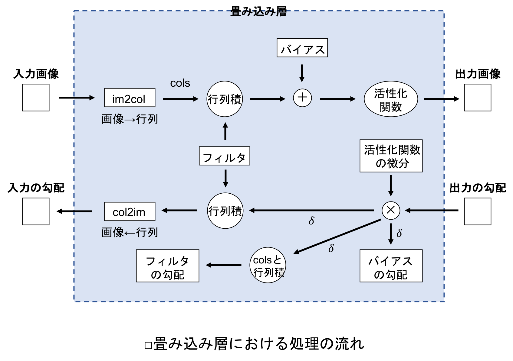

[](2019/05/12)

## 7.3 畳み込み層の実装
### 7.3.1 実装の概要
- 畳み込み層における処理の流れは次の通り：

<center>

</center>

- 通常のニューラルネットワークと同様に，順伝播では出力を，逆伝播においては入力の勾配を次の層に伝播させる．
- 上図における上側の流れが順伝播．
- im2colにより変換された行列をcolsとすると，このcolsとフィルタの行列積で畳み込みをおこない，バイアスを足して活性化関数で処理したものが出力となる．
- 下の層から伝播した出力の勾配に，活性化関数の微分をかけたものを $\delta$ とすると，バイアスの勾配はこの $\delta$ になる．
- フィルタの勾配は，この $\delta$ とcolsの行列積により求めることができる．
- そして，$\delta$ とフィルタの行列積はcolsの形状になるが，これをcol2imにより画像の形状に戻したものが入力の勾配になる．
- $\delta$ を使ってフィルタ，重みと入力の勾配を求める点は，通常のニューラルネットワークと似ている．

<br>

- 畳み込み層は，以下のようにクラスとして実装する：
``` python
class ConvLayer:
    # x_ch : 入力チャンネル数, x_h : 入力画像高さ, x_w : 入力画像幅
    # n_flt : フィルタの数, flt_h : フィルタ高さ, flt_w : フィルタ幅
    # stride : ストライド幅, pad : パディング幅

    def __init__(self, x_ch, x_h, x_w, n_flt, flt_h, flt_w, stride, pad):

        # パラメータをまとめる
        self.params = (x_ch, x_h, x_w, n_flt, flt_h, flt_w, stride, pad)

        # フィルタとバイアスの初期値
        self.w = wb_width * np.random.randn(n_flt, x_ch, flt_h, flt_w)
        self.b = wb_width * np.random.randn(1, n_flt)

        # 出力画像のサイズ
        self.y_ch = n_flt # 出力チャンネル数
        self.y_h = (x_h - flt_h + 2*pad) // stride + 1 # 出力高さ
        self.y_w = (x_w - flt_w + 2*pad) // stride + 1 # 出力幅

        ...
```

- コンストラクタ（__init__メソッド）では，変更したり外部からアクセス知ら利する必要のないパラメータを`self.params`にまとめている．
- 出力画像のチャンネル数，高さ，幅は，外部からアクセス可能にするために`self`がつけられている．
- このクラスに順伝播と逆伝播のメソッドを記述していく．

<br>

### 7.3.2 順伝播
- 畳み込み層における順伝播の処理は，活性化関数を`f`として以下のように表すことができる：
``` python
cols = im2col( 入力 ) # 画像から行列に変換
出力  = f( フィルタとcolsの行列積 + バイアス )
```

- <u>順伝播は以下の流れで実装する：</u>
   1. im2colにより入力画像を行列に変換
   2. 複数のフィルタを１つの行列に変換
   3. 入力画像を表す行列と，フィルタを表す行列の行列積を計算する
   4. バイアスを加える
   5. 出力の形状を整える
   6. 活性化関数による処理

<br>

- 順伝播のメソッドを以下に示す：
``` python
    ...

    def forward(self, x):
        n_bt = x.shape[0]
        x_ch, x_h, x_w, n_flt, flt_h, flt_w, y_h, y_w, stride, pad = self.params
        x_ch, x_h, x_w = self.y_ch, self.y_h, self.y_w

        # 入力画像とフィルタを行列に変換
        self.cols = im2col(x, flt_h, flt_w, y_h, y_w, stride, pad)
        self.w_col = self.w.reshape(n_flt, x_ch*flt_h*flt_w)

        # 出力の計算 : 行列積，バイアスの加算，活性化関数
        u = np.dot(self.w_col, self.cols).T + self.b
        self.u = u.reshape(n_bt, y_h, y_w, y_ch).transpose(0, 3, 1, 2)
        self.y = np.where(self.u <= 0, 0, self.u)
```

- <u>`self`が付いている変数は，他のメソッドと共有するインスタンス変数．</u>
- 引数として受け取る入力画像`x`は次の形状をしている：
$$
(B, C, I_h, I_w)．
$$
- また，フィルタ`self.w`は次の形状をしている：
$$
(M, C, F_h, F_w)．
$$
- メソッド内では，最初に`im2col`で入力画像を行列に変換する：
``` python
self.cols = im2col(x, flt_h, flt_w, y_h, y_w, stride, pad)
```
- `im2col`の結果，この行列`self.cols`は次の形状になる：
$$
(CF_hF_w, BO_hO_w)．
$$
- そして，フィルタは次のコードで行列に変換しておく（`self.w`がフィルタで，`self.w_col`がそれを行列に変換したもの）：
``` python
self.w_col = self.w.reshape(n_flt, x_ch*flt_h*flt_w)
```
- この行列`self.w_col`の形状は次の通り：
$$
(M, CF_hF_w)．
$$
- 次のコードで`self.w_col`と`self.cols`の行列積をNumPyのdot関数により計算する：
``` python
u = np.dot(self.w_col, self.cols).T + self.b
```
- 行列積の結果，次の形状の行列ができる：
$$
(M, BO_hO_w)．
$$
- これを，バイアスと列数を合わせるために転置したうえで，バイアスを加える．そして，`reshape`と`transpose`により出力の形状を整える：
``` python
self.u = u.reshape(n_bt, y_h, y_w, y_ch).transpose(0, 3, 1, 2)
```
- これにより，`self.u`の形状は次の通りになる：
$$
(B, M, O_h, O_w)．
$$
- 上記のフィルタ数 $M$ は，出力画像のチャンネル数と考えることができる．
- したがって，入力画像と同じように，出力もバッチとチャンネルに対応することになる．
- 最後に，活性化関数ReLUでこの`self.u`を処理して，順伝播の出力とする．
``` python 
self.y = np.where(self.u <= 0, 0, self.u)
```

<br>

- 以上が順伝播の実装．フィルタを重みに置き換えれば，通常のニューラルネットワークの層における順伝播に似ている．

<br>

### 7.3.3 逆伝播