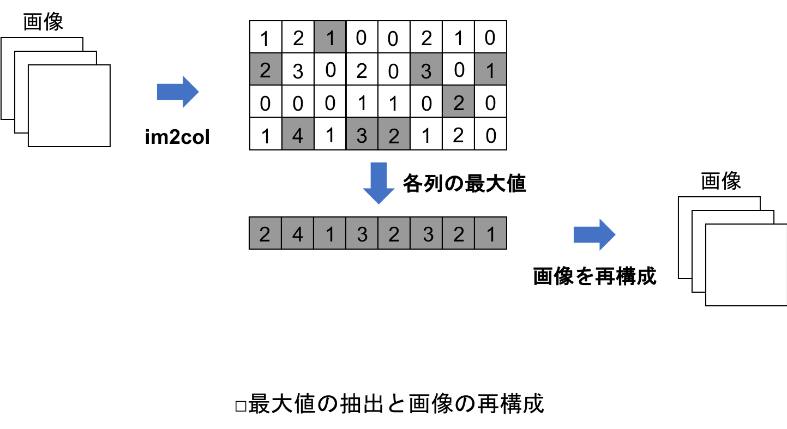
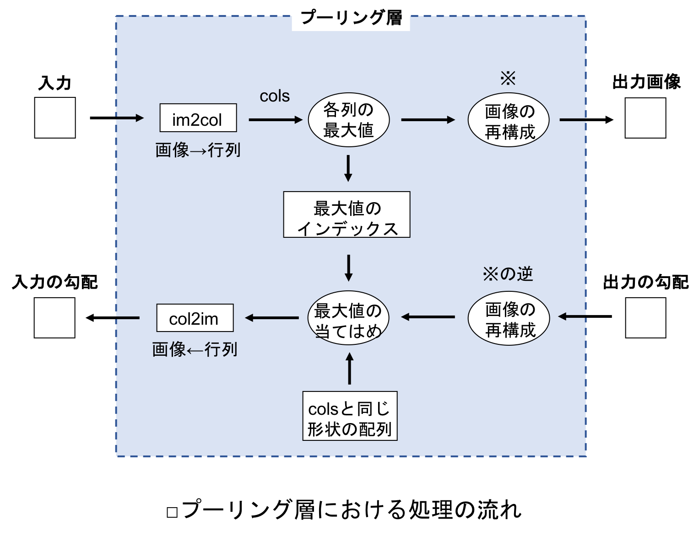

[](2019/05/18)

## 7.4 プーリング層の実装
### 7.4.1 実装の概要
- プーリング層の入出力画像は，畳み込み層の入出力と同じ形式．
- バッチ，チャンネルに対応した4次元配列（4階のテンソル）．
- 今回はMax poolingをおこなうため，順伝播では画像の各領域の最大値を選択し，縮小された画像を作成する．

<br>

- この実装にはim2colを使用する．
- 次のように，im2colで入力を行列に変換するが，フィルタ幅とストライドの幅を同じにすることで，画像を正方形に区切り，区切られた領域を行列の形に変換することができる：

<center>

</center>

- この変換された行列の，各列の最大値から画像を再構成することで，各領域の最大値が抽出された画像が生成される：

<center>

</center>

- プーリングによりピクセル数が減少するため，画像サイズは小さくなる．

#### プーリング層における処理の流れ
- プーリング層における処理の流れは以下の通り：
<center>

</center>

- 逆伝播においては入力の勾配を層間で伝播させるが，これは畳み込み層や全結合層と同様．
- <u>順伝播ではcolsの各列の最大値を抽出するが，この際に各列の最大値のインデックスを保存しておく．</u>
- 逆伝播では，colsと同じ形状の行列における最大値のインデックスの位置に出力の勾配を当てはめ，col2imにより画像の形状に戻して入力の勾配とする．

#### プーリング層のコード
- プーリング層は，以下のようにクラスとして実装する：
``` python
class PoolingLayer:

    # x_ch : 入力チャンネル数, x_h : 入力画像の高さ, x_w : 入力画像の幅
    # pool : プーリング領域のサイズ, pad : パディング幅

    def __init__(self, x_ch, x_h, x_w, pool, pad):

        # パラメータをまとめる
        self.params = (x_ch, x_h, x_w, pool, pad)

        self.y_ch = x_ch # 出力チャンネル数
        self.y_h = x_h//pool if x_h%pool == 0 else x_h//pool+1 # 出力高さ
        self.y_w = x_w//pool if x_w%pool == 0 else x_w//pool+1 # 出力幅

        ...
```

- このクラスに，順伝播と逆伝播のメソッドを記述していく．

<br>

### 7.4.2 順伝播

<br>

### 7.4.3 逆伝播